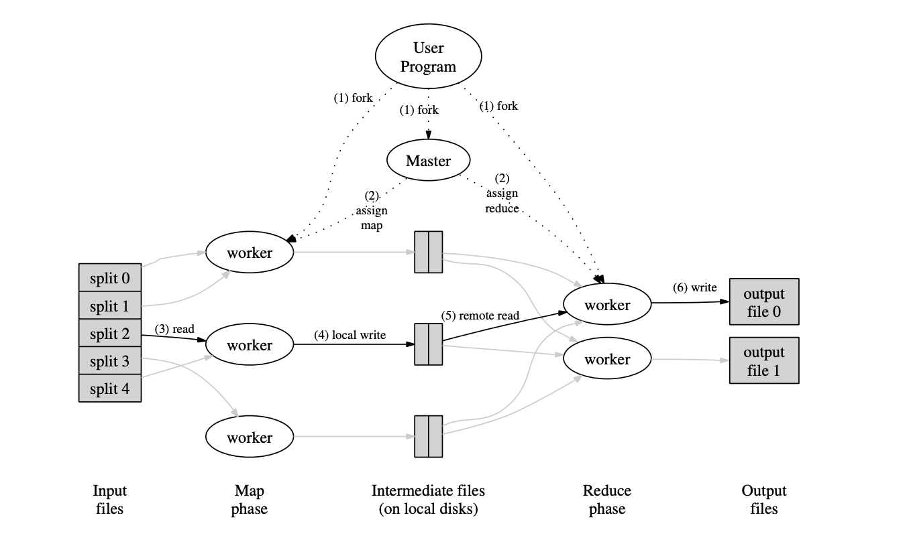

##  摘要
MapReduce是一个编程模型，也是一个处理和生成超大数据集的算法模型的相关实现。用户首先创建一个Map函数处理一个基于key/value pair的数据集合，输出中间的基于key/value pair的数据集合；然后再创建一个Reduce函数用来合并所有的具有相同中间key值的中间value值。现实世界中有很多满足上述处理模型的例子

MapReduce架构的程序能够在大量的普通配置的计算机上实现并行化处理。这个系统在运行时只关心：如何分割输入数据，在大量计算机组成的集群上的调度，集群中计算机的错误处理，管理集群中计算机之间必要的通信。


## 编程模型

MapReduce编程模型的原理是：**利用一个输入key/value pair集合来产生一个输出的key/value pair集合。MapReduce库的用户用两个函数表达这个计算：Map和Reduce。**

用户自定义的Map函数接受一个输入的key/value pair值，然后产生一个中间key/value pair值的集合。MapReduce库把所有具有相同中间key值I的中间value值集合在一起后传递给reduce函数。

用户自定义的Reduce函数接受一个中间key的值I和相关的一个value值的集合。Reduce函数合并这些value值，形成一个较小的value值的集合。一般的，每次Reduce函数调用只产生0或1个输出value值。通常我们通过一个迭代器把中间value值提供给Reduce函数，这样我们就可以处理无法全部放入内存中的大量的value值的集合。

### Example

下面来考虑这样一个问题：统计大量文档中每一个单词出现的次数。
```go
map(String key, String value):   
    // key: document name    
    // value: document contents   
    for each word w in value:   
        EmitIntermediate(w, “1″);   
reduce(String key, Iterator values):   
    // key: a word   
    // values: a list of counts   
    int result = 0;   
    for each v in values:   
        result += ParseInt(v);   
    Emit(AsString(result));   
```

Map函数输出文档中的每个词、以及这个词的出现次数(在这个简单的例子里就是1)。Reduce函数把Map函数产生的每一个特定的词的计数累加起来。

### 更多的例子

这里还有一些有趣的简单例子，可以很容易的使用MapReduce模型来表示：

- 分布式的Grep：Map函数输出匹配某个模式的一行，Reduce函数是一个恒等函数，即把中间数据复制到输出。
- 计算URL访问频率：Map函数处理日志中web页面请求的记录，然后输出(URL,1)。Reduce函数把相同URL的value值都累加起来，产生(URL,记录总数)结果。
- 倒转网络链接图：Map函数在源页面（source）中搜索所有的链接目标（target）并输出为(target,source)。Reduce函数把给定链接目标（target）的链接组合成一个列表，输出(target,list(source))。
- 每个主机的检索词向量：检索词向量用一个(词,频率)列表来概述出现在文档或文档集中的最重要的一些词。Map函数为每一个输入文档输出(主机名,检索词向量)，其中主机名来自文档的URL。Reduce函数接收给定主机的所有文档的检索词向量，并把这些检索词向量加在一起，丢弃掉低频的检索词，输出一个最终的(主机名,检索词向量)。
- 倒排索引：Map函数分析每个文档输出一个(词,文档号)的列表，Reduce函数的输入是一个给定词的所有（词，文档号），排序所有的文档号，输出(词,list（文档号）)。所有的输出集合形成一个简单的倒排索引，它以一种简单的算法跟踪词在文档中的位置。
- 分布式排序：Map函数从每个记录提取key，输出(key,record)。Reduce函数不改变任何的值。

### 执行概括


上图展示了我们的MapReduce实现中操作的全部流程。当用户调用MapReduce函数时，将发生下面的一系列动作（下面的序号和图1中的序号一一对应）：

- 用户程序首先调用的MapReduce库将输入文件分成M个数据片度，每个数据片段的大小一般从 16MB到64MB(可以通过可选的参数来控制每个数据片段的大小)。然后用户程序在机群中创建大量的程序副本。 
- 这些程序副本中的有一个特殊的程序–master。副本中其它的程序都是worker程序，由master分配任务。有M个Map任务和R个Reduce任务将被分配，master将一个Map任务或Reduce任务分配给一个空闲的worker。
- 被分配了map任务的worker程序读取相关的输入数据片段，从输入的数据片段中解析出key/value pair，然后把key/value pair传递给用户自定义的Map函数，由Map函数生成并输出的中间key/value pair，并缓存在内存中。
- 缓存中的key/value pair通过分区函数分成R个区域，之后周期性的写入到本地磁盘上。缓存的key/value pair在本地磁盘上的存储位置将被回传给master，由master负责把这些存储位置再传送给Reduce worker。
- 当Reduce worker程序接收到master程序发来的数据存储位置信息后，使用RPC从Map worker所在主机的磁盘上读取这些缓存数据。当Reduce worker读取了所有的中间数据后，通过对key进行排序后使得具有相同key值的数据聚合在一起。由于许多不同的key值会映射到相同的Reduce任务上，因此必须进行排序。如果中间数据太大无法在内存中完成排序，那么就要在外部进行排序。
- Reduce worker程序遍历排序后的中间数据，对于每一个唯一的中间key值，Reduce worker程序将这个key值和它相关的中间value值的集合传递给用户自定义的Reduce函数。Reduce函数的输出被追加到所属分区的输出文件。
- 当所有的Map和Reduce任务都完成之后，master唤醒用户程序。在这个时候，在用户程序里的对MapReduce调用才返回。

在成功完成任务之后，MapReduce的输出存放在R个输出文件中（对应每个Reduce任务产生一个输出文件，文件名由用户指定）。一般情况下，用户不需要将这R个输出文件合并成一个文件–他们经常把这些文件作为另外一个MapReduce的输入，或者在另外一个可以处理多个分割文件的分布式应用中使用。

### Master数据结构

Master持有一些数据结构，它存储每一个Map和Reduce任务的状态（空闲、工作中或完成)，以及Worker机器(非空闲任务的机器)的标识。

Master就像一个数据管道，中间文件存储区域的位置信息通过这个管道从Map传递到Reduce。因此，**对于每个已经完成的Map任务，master存储了Map任务产生的R个中间文件存储区域的大小和位置。当Map任务完成时，Master接收到位置和大小的更新信息，这些信息被逐步递增的推送给那些正在工作的Reduce任务。**

### 容错

因为MapReduce库的设计初衷是使用由成百上千的机器组成的集群来处理超大规模的数据，所以，这个库必须要能很好的处理机器故障。
#### worker故障

**master周期性的ping每个worker**。如果在一个约定的时间范围内没有收到worker返回的信息，master将把这个worker标记为失效。所有由这个失效的worker完成的Map任务被重设为初始的空闲状态，之后这些任务就可以被安排给其他的worker。同样的，worker失效时正在运行的Map或Reduce任务也将被重新置为空闲状态，等待重新调度。

当worker故障时，由于已经完成的Map任务的输出存储在这台机器上，Map任务的输出已不可访问了，因此必须重新执行。而已经完成的Reduce任务的输出存储在全局文件系统上，因此不需要再次执行。

当一个Map任务首先被worker A执行，之后由于worker A失效了又被调度到worker B执行，这个“重新执行”的动作会被通知给所有执行Reduce任务的worker。任何还没有从worker A读取数据的Reduce任务将从worker B读取数据。

#### master失败

**一个简单的解决办法是让master周期性的将上面描述的数据结构的写入磁盘，即检查点（checkpoint）。如果这个master任务失效了，可以从最后一个检查点（checkpoint）开始启动另一个master进程。** 然而，由于只有一个master进程，master失效后再恢复是比较麻烦的，因此我们现在的实现是如果master失效，就中止MapReduce运算。客户可以检查到这个状态，并且可以根据需要重新执行MapReduce操作。

#### 在失效方面的处理机制

当用户提供的Map和Reduce操作是输入确定性函数（即相同的输入产生相同的输出）时，我们的分布式实现在任何情况下的输出都和所有程序没有出现任何错误、顺序的执行产生的输出是一样的。

我们依赖对Map和Reduce任务的输出是原子提交的来完成这个特性。每个工作中的任务把它的输出写到私有的临时文件中。每个Reduce任务生成一个这样的文件，而每个Map任务则生成R个这样的文件（一个Reduce任务对应一个文件）。当一个Map任务完成的时，worker发送一个包含R个临时文件名的完成消息给master。如果master从一个已经完成的Map任务再次接收到到一个完成消息，master将忽略这个消息；否则，master将这R个文件的名字记录在数据结构里。

当Reduce任务完成时，Reduce worker进程以原子的方式把临时文件重命名为最终的输出文件。如果同一个Reduce任务在多台机器上执行，针对同一个最终的输出文件将有多个重命名操作执行。我们依赖底层文件系统提供的重命名操作的原子性来保证最终的文件系统状态仅仅包含一个Reduce任务产生的数据。

### 存储位置

在我们的计算运行环境中，网络带宽是一个相当匮乏的资源。我们通过尽量把输入数据(由GFS管理)存储在集群中机器的本地磁盘上来节省网络带宽。GFS把每个文件按64MB一个Block分隔，每个Block保存在多台机器上，环境中就存放了多份拷贝(一般是3个拷贝)。MapReduce的master在调度Map任务时会考虑输入文件的位置信息，尽量将一个Map任务调度在包含相关输入数据拷贝的机器上执行；如果上述努力失败了，master将尝试在保存有输入数据拷贝的机器附近的机器上执行Map任务。当在一个足够大的cluster集群上运行大型MapReduce操作的时候，大部分的输入数据都能从本地机器读取，因此消耗非常少的网络带宽。

### 任务粒度

如前所述，我们把Map拆分成了M个片段、把Reduce拆分成R个片段执行。理想情况下，M和R应当比集群中worker的机器数量要多得多。在每台worker机器都执行大量的不同任务能够提高集群的动态的负载均衡能力，并且能够加快故障恢复的速度：失效机器上执行的大量Map任务都可以分布到所有其他的worker机器上去执行。

### 备用任务

影响一个MapReduce的总执行时间最通常的因素是“落伍者”：在运算过程中，如果有一台机器花了很长的时间才完成最后几个Map或Reduce任务，导致MapReduce操作总的执行时间超过预期。出现“落伍者”的原因非常多。比如：如果一个机器的硬盘出了问题，在读取的时候要经常的进行读取纠错操作，导致读取数据的速度从30M/s降低到1M/s。如果cluster的调度系统在这台机器上又调度了其他的任务，由于CPU、内存、本地硬盘和网络带宽等竞争因素的存在，导致执行MapReduce代码的执行效率更加缓慢。我们最近遇到的一个问题是由于机器的初始化代码有bug，导致关闭了的处理器的缓存：在这些机器上执行任务的性能和正常情况相差上百倍。

我们有一个通用的机制来减少“落伍者”出现的情况。当一个MapReduce操作接近完成的时候，master调度备用（backup）任务进程来执行剩下的、处于处理中状态（in-progress）的任务。无论是最初的执行进程、还是备用（backup）任务进程完成了任务，我们都把这个任务标记成为已经完成。我们调优了这个机制，通常只会占用比正常操作多几个百分点的计算资源。我们发现采用这样的机制对于减少超大MapReduce操作的总处理时间效果显著。

## 技巧

虽然简单的Map和Reduce函数提供的基本功能已经能够满足大部分的计算需要，我们还是发掘出了一些有价值的扩展功能。本节将描述这些扩展功能。

### 分区函数

MapReduce的使用者通常会指定Reduce任务和Reduce任务输出文件的数量（R）。我们在中间key上使用分区函数来对数据进行分区，之后再输入到后续任务执行进程。一个缺省的分区函数是使用hash方法(比如，hash(key) mod R)进行分区。hash方法能产生非常平衡的分区。然而，有的时候，其它的一些分区函数对key值进行的分区将非常有用。比如，输出的key值是URLs，我们希望每个主机的所有条目保持在同一个输出文件中。为了支持类似的情况，MapReduce库的用户需要提供专门的分区函数。

### 顺序保证

我们确保在给定的分区中，中间key/value pair数据的处理顺序是按照key值增量顺序处理的。这样的顺序保证对每个分成生成一个有序的输出文件，这对于需要对输出文件按key值随机存取的应用非常有意义，对在排序输出的数据集也很有帮助。

### Combiner函数

在某些情况下，Map函数产生的中间key值的重复数据会占很大的比重，并且，用户自定义的Reduce函数满足结合律和交换律。在2.1节的词数统计程序是个很好的例子。由于词频率倾向于一个zipf分布(齐夫分布)，每个Map任务将产生成千上万个这样的记录the,1.所有的这些记录将通过网络被发送到一个单独的Reduce任务，然后由这个Reduce任务把所有这些记录累加起来产生一个数字。我们允许用户指定一个可选的combiner函数，combiner函数首先在本地将这些记录进行一次合并，然后将合并的结果再通过网络发送出去。

Combiner函数在每台执行Map任务的机器上都会被执行一次。一般情况下，Combiner和Reduce函数是一样的。Combiner函数和Reduce函数之间唯一的区别是MapReduce库怎样控制函数的输出。Reduce函数的输出被保存在最终的输出文件里，而Combiner函数的输出被写到中间文件里，然后被发送给Reduce任务。

部分的合并中间结果可以显著的提高一些MapReduce操作的速度。

### 输入和输出的类型

MapReduce库支持几种不同的格式的输入数据。比如，文本模式的输入数据的每一行被视为是一个key/value pair。key是文件的偏移量，value是那一行的内容。另外一种常见的格式是以key进行排序来存储的key/value pair的序列。每种输入类型的实现都必须能够把输入数据分割成数据片段，该数据片段能够由单独的Map任务来进行后续处理(例如，文本模式的范围分割必须确保仅仅在每行的边界进行范围分割)。虽然大多数MapReduce的使用者仅仅使用很少的预定义输入类型就满足要求了，但是使用者依然可以通过提供一个简单的Reader接口实现就能够支持一个新的输入类型。

Reader并非一定要从文件中读取数据，比如，我们可以很容易的实现一个从数据库里读记录的Reader，或者从内存中的数据结构读取数据的Reader。  
类似的，我们提供了一些预定义的输出数据的类型，通过这些预定义类型能够产生不同格式的数据。用户采用类似添加新的输入数据类型的方式增加新的输出类型。

### 副作用

在某些情况下，MapReduce的使用者发现，如果在Map和/或Reduce操作过程中增加辅助的输出文件会比较省事。我们依靠程序writer把这种“副作用”变成原子的和幂等的（alex注：幂等的指一个总是产生相同结果的数学运算）。通常应用程序首先把输出结果写到一个临时文件中，在输出全部数据之后，在使用系统级的原子操作rename重新命名这个临时文件。

如果一个任务产生了多个输出文件，我们没有提供类似两阶段提交的原子操作支持这种情况。因此，对于会产生多个输出文件、并且对于跨文件有一致性要求的任务，都必须是确定性的任务。但是在实际应用过程中，这个限制还没有给我们带来过麻烦。

### 跳过损坏的记录

有时候，用户程序中的bug导致Map或者Reduce函数在处理某些记录的时候crash掉，MapReduce操作无法顺利完成。惯常的做法是修复bug后再次执行MapReduce操作，但是，有时候找出这些bug并修复它们不是一件容易的事情；这些bug也许是在第三方库里边，而我们手头没有这些库的源代码。而且在很多时候，忽略一些有问题的记录也是可以接受的，比如在一个巨大的数据集上进行统计分析的时候。我们提供了一种执行模式，在这种模式下，为了保证保证整个处理能继续进行，MapReduce会检测哪些记录导致确定性的crash，并且跳过这些记录不处理。

每个worker进程都设置了信号处理函数捕获内存段异常（segmentation violation）和总线错误（bus error）。在执行Map或者Reduce操作之前，MapReduce库通过全局变量保存记录序号。如果用户程序触发了一个系统信号，消息处理函数将用“最后一口气”通过UDP包向master发送处理的最后一条记录的序号。当master看到在处理某条特定记录不止失败一次时，master就标志着条记录需要被跳过，并且在下次重新执行相关的Map或者Reduce任务的时候跳过这条记录。

### 状态信息

master使用嵌入式的HTTP服务器显示一组状态信息页面，用户可以监控各种执行状态。状态信息页面显示了包括计算执行的进度，比如已经完成了多少任务、有多少任务正在处理、输入的字节数、中间数据的字节数、输出的字节数、处理百分比等等。页面还包含了指向每个任务的stderr和stdout文件的链接。用户根据这些数据预测计算需要执行大约多长时间、是否需要增加额外的计算资源。这些页面也可以用来分析什么时候计算执行的比预期的要慢。

另外，处于最顶层的状态页面显示了哪些worker失效了，以及他们失效的时候正在运行的Map和Reduce任务。这些信息对于调试用户代码中的bug很有帮助。

### 计数器

MapReduce库使用计数器统计不同事件发生次数。

为了使用这个特性，用户在程序中创建一个命名的计数器对象，在Map和Reduce函数中相应的增加计数器的值。例如：

```go
Counter* uppercase;
uppercase = GetCounter(“uppercase”);
map(String name, String contents):
 for each word w in contents:
  if (IsCapitalized(w)):
   uppercase->Increment();
  EmitIntermediate(w, “1″);
```

这些计数器的值周期性的从各个单独的worker机器上传递给master（附加在ping的应答包中传递）。master把执行成功的Map和Reduce任务的计数器值进行累计，当MapReduce操作完成之后，返回给用户代码。

计数器当前的值也会显示在master的状态页面上，这样用户就可以看到当前计算的进度。当累加计数器的值的时候，master要检查重复运行的Map或者Reduce任务，避免重复累加（之前提到的备用任务和失效后重新执行任务这两种情况会导致相同的任务被多次执行）。

有些计数器的值是由MapReduce库自动维持的，比如已经处理的输入的key/value pair的数量、输出的key/value pair的数量等等。

计数器机制对于MapReduce操作的完整性检查非常有用。比如，在某些MapReduce操作中，用户需要确保输出的key value pair精确的等于输入的key value pair，或者处理的German文档数量在处理的整个文档数量中属于合理范围。