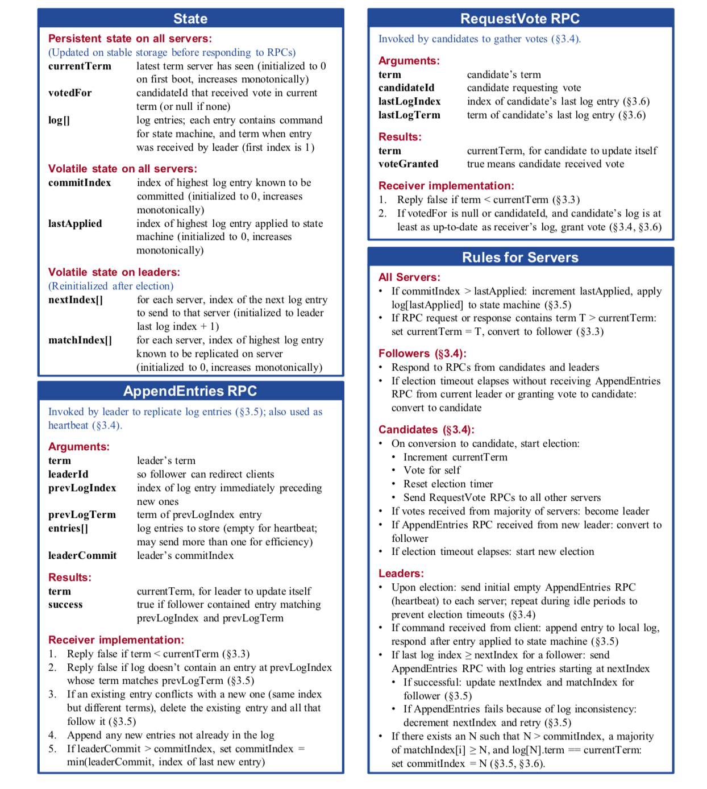
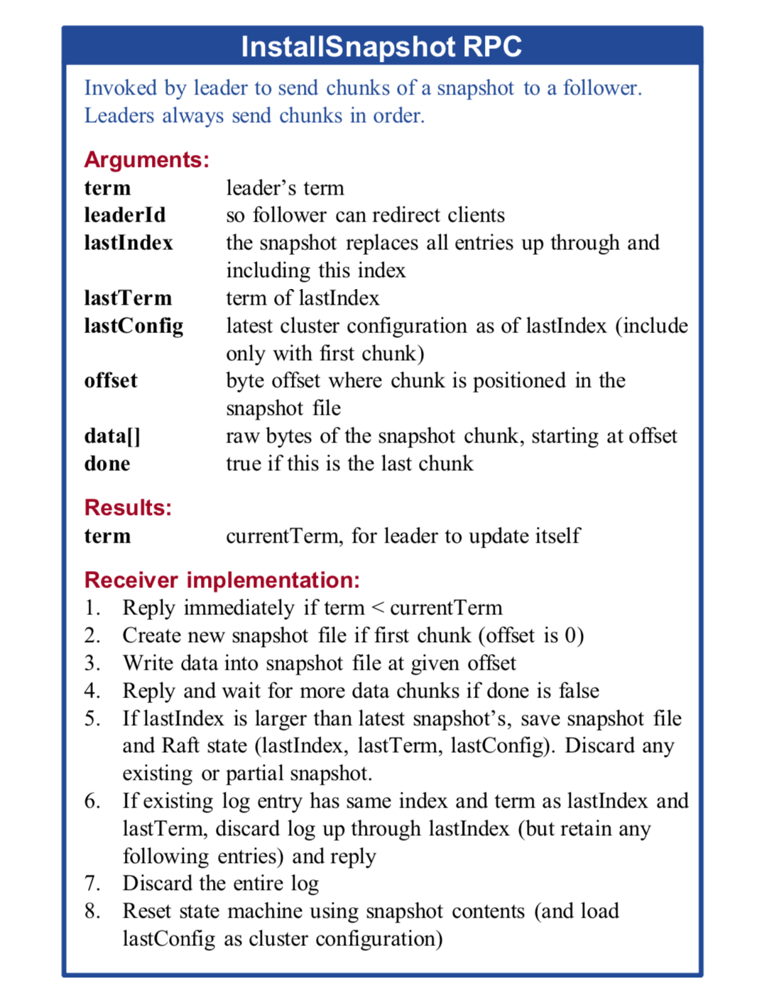

## 使用复制状态机实现容错

共识算法通常出现在复制状态机的环境中。在此过程中，服务器集合上的状态机计算相同状态的相同副本，即使某些服务器宕机，状态机也可以继续运行。**复制状态机用于解决分布式系统中的各种容错问题，**

复制状态机通常使用复制日志来实现。每个服务器存储一个包含一系列命令的日志，其状态机按顺序执行这些命令。每个日志以相同的顺序包含相同的命令，因此每个状态机处理相同的命令序列。由于状态机是确定性的，因此每个状态机都计算相同的状态和相同的输出序列。

保持复制日志的一致性是共识算法的工作。 服务器上的共识模块从客户端接收命令并将它们添加到其日志中。它与其他服务器上的共识模块通信，以确保即使某些服务器发生故障，每个日志最终仍将以相同顺序包含相同的请求。一旦正确复制了命令，就称它们已提交。每个服务器的状态机均以日志顺序处理已提交的命令，并将输出返回给客户端。因此，服务器似乎形成了一个单独的，高度可靠的状态机。

实际系统的共识算法通常具有以下属性：

- 它们可确保在所有非拜占庭条件下的安全性（绝不会返回错误的结果），包括网络延迟，分区，数据包丢失，重复和重新排序。
- 只要任何大多数服务器都可以运行并且可以相互通信以及与客户端进行通信，它们就可以正常运行（可用）。因此，由五个服务器组成的典型集群可以容忍任何两个服务器的故障。假定服务器因停止而发生故障；它们稍后可能会从稳定存储上的状态中恢复并重新加入集群。
- 它们不依赖于时间来确保日志的一致性：错误的时钟和极端的消息延迟，在最坏的情况下，只可能会导致可用性问题。也就是说，它们可以在消息和处理器都以任意速度运行的异步模型下保持安全性。
- 在通常情况下，只要集群中的大多数服务器都响应了一次远程过程调用，命令就可以完成。少数运行缓慢的服务器不影响整体系统性能。

## Raft 算法基础

### Raft 概述

>Raft 共识算法的精简摘要（不包括成员资格更改，日志压缩和客户端交互）。 右下角框中的服务器行为被描述为一组独立且重复触发的规则。

**Raft通过首先选举一个领导者，然后让领导者完全负责管理复制的日志来实现一致性。领导者从客户端接收日志条目，再把其复制到其他服务器上，并告诉服务器何时可以安全地将日志条目应用于其状态机。** 拥有领导者大大简化了复制日志的管理。例如，领导者可以决定新的日志条目需要放在日志中的什么位置而不需要和其他服务器商议，并且数据都以简单的方式从领导者流向其他服务器。领导者可能会失败或与其他服务器断开连接，在这种情况下，将选举出新的领导者。

通过领导者的方式，Raft 将一致性问题分解成了三个相对独立的子问题，以下各小节对此进行了讨论：

- **领导者选举** ：启动集群时以及现有领导者失败时必须选出新的领导者。
- **日志复制** ：领导者必须接受来自客户端的日志条目，并在整个集群中复制它们，迫使其他日志与其自己的日志一致。
- **安全性** ：Raft 的安全属性的关键是的状态机安全性属性：如果任何服务器已将特定的日志条目应用于其状态机，则其他服务器都不可以对同一日志索引应用不同的命令。

### 节点状态

一个 Raft 集群包含若干个服务器节点；通常是 5 个，这允许整个系统容忍 2 个节点的失效。在任何时刻，每一个服务器节点都处于这三个状态之一：**领导者、跟随者或者候选人** 。在通常情况下，系统中只有一个领导者并且其他的节点全部都是跟随者。跟随者都是被动的：他们不会发送任何请求，只是简单的响应来自领导者或者候选人的请求。领导者处理所有的客户端请求（如果一个客户端和跟随者联系，那么跟随者会把请求重定向给领导者）。第三种状态，候选人，

>服务器状态。跟随者只响应来自其他服务器的请求。如果跟随者接收不到消息，那么他就会变成候选人并发起一次选举。获得集群中大多数选票的候选人将成为领导者。在一个任期内，领导者一直都会是领导者直到自己宕机了。
### 任期

**Raft 把时间分割成任意长度的任期** ，如图。任期用连续的整数标记。每一段任期从一次选举开始，一个或者多个候选人尝试成为领导者。如果一个候选人赢得选举，然后他就在接下来的任期内充当领导者的职责。在某些情况下，一次选举过程会造成选票的瓜分。在这种情况下，这一任期会以没有领导者结束；一个新的任期（和一次新的选举）会很快重新开始。Raft 保证了在一个给定的任期内，最多只有一个领导者。

>时间被划分成一个个的任期，每个任期开始都是一次选举。在选举成功后，领导者会管理整个集群直到任期结束。有时候选举会失败，那么这个任期就会没有领导者而结束。任期之间的切换可以在不同的时间不同的服务器上观察到。

不同的服务器节点可能多次观察到任期之间的转换，但在某些情况下，一个节点也可能观察不到任何一次选举或者整个任期全程。任期在 Raft 算法中充当逻辑时钟的作用，这会允许服务器节点查明一些过期的信息比如陈旧的领导者。**每一个节点存储一个当前任期号，这一编号在整个时期内单调的增长。当服务器之间通信的时候会交换当前任期号；如果一个服务器的当前任期号比其他人小，那么他会更新自己的编号到较大的编号值。如果一个候选人或者领导者发现自己的任期号过期了，那么他会立即恢复成跟随者状态。如果一个节点接收到一个包含过期的任期号的请求，那么他会直接拒绝这个请求** 。

### 领导者选举

Raft 使用一种心跳机制来触发领导者选举。当服务器程序启动时，他们都是跟随者身份。一个服务器节点继续保持着跟随者状态只要他从领导者或者候选人处接收到有效的 RPCs。领导者周期性的向所有跟随者发送心跳包（即不包含日志项内容的附加日志项 RPCs）来维持自己的权威。如果一个跟随者在一段时间里没有接收到任何消息，也就是选举超时，那么他就会认为系统中没有可用的领导者,并且发起选举以选出新的领导者。

要开始一次选举过程，跟随者先要增加自己的当前任期号并且转换到候选人状态。然后他会并行的向集群中的其他服务器节点发送请求投票的 RPCs 来给自己投票。候选人会继续保持着当前状态直到以下三件事情之一发生：(a) 他自己赢得了这次的选举，(b) 其他的服务器成为领导者，(c) 一段时间之后没有任何一个获胜的人。这些结果会分别的在下面的段落里进行讨论。

1. **当一个候选人从整个集群的大多数服务器节点获得了针对同一个任期号的选票，那么他就赢得了这次选举并成为领导者。每一个服务器最多会对一个任期号投出一张选票，按照先来先服务的原则。要求大多数选票的规则确保了最多只会有一个候选人赢得此次选举。一旦候选人赢得选举，他就立即成为领导者。然后他会向其他的服务器发送心跳消息来建立自己的权威并且阻止新的领导者的产生。**
2. **在等待投票的时候，候选人可能会从其他的服务器接收到声明它是领导者的附加日志项 RPC。如果这个领导者的任期号（包含在此次的 RPC中）不小于候选人当前的任期号，那么候选人会承认领导者合法并回到跟随者状态。 如果此次 RPC 中的任期号比自己小，那么候选人就会拒绝这次的 RPC 并且继续保持候选人状态。**
3. **第三种可能的结果是候选人既没有赢得选举也没有输：如果有多个跟随者同时成为候选人，那么选票可能会被瓜分以至于没有候选人可以赢得大多数人的支持。当这种情况发生的时候，每一个候选人都会超时，然后通过增加当前任期号来开始一轮新的选举。然而，没有其他机制的话，选票可能会被无限的重复瓜分。**

**Raft 算法使用随机选举超时时间的方法来确保很少会发生选票瓜分的情况，就算发生也能很快的解决。** 为了阻止选票起初就被瓜分，选举超时时间是从一个固定的区间（例如 150-300 毫秒）随机选择。这样可以把服务器都分散开以至于在大多数情况下只有一个服务器会选举超时；然后他赢得选举并在其他服务器超时之前发送心跳包。同样的机制被用在选票瓜分的情况下。每一个候选人在开始一次选举的时候会重置一个随机的选举超时时间，然后在超时时间内等待投票的结果；这样减少了在新的选举中另外的选票瓜分的可能性。

### 日志复制

一旦一个领导者被选举出来，他就开始为客户端提供服务。**客户端的每一个请求都包含一条被复制状态机执行的指令。** 领导者把这条指令作为一条新的日志条目附加到日志中去，然后并行的发起附加条目 RPCs 给其他的服务器，让他们复制这条日志条目。当这条日志条目被安全的复制，领导者会应用这条日志条目到它的状态机中然后把执行的结果返回给客户端。如果跟随者崩溃或者运行缓慢，再或者网络丢包，领导者会不断的重复尝试附加日志条目 RPCs （尽管已经回复了客户端）直到所有的跟随者都最终存储了所有的日志条目。

日志以下图 展示的方式组织。每一个日志条目存储一条状态机指令和从领导者收到这条指令时的任期号。日志中的任期号用来检查是否出现不一致的情况，同时也用来保证图中的某些性质。每一条日志条目同时也都有一个整数索引值来表明它在日志中的位置。

**领导者来决定什么时候把日志条目应用到状态机中是安全的；这种日志条目被称为已提交。** Raft 算法保证所有已提交的日志条目都是持久化的并且最终会被所有可用的状态机执行。在领导者将创建的日志条目复制到大多数的服务器上的时候，日志条目就会被提交在。同时，领导者的日志中之前的所有日志条目也都会被提交，包括由其他领导者创建的条目。领导者跟踪了最大的将会被提交的日志项的索引，并且索引值会被包含在未来的所有附加日志 RPCs （包括心跳包），这样其他的服务器才能最终知道领导者的提交位置。一旦跟随者知道一条日志条目已经被提交，那么他也会将这个日志条目应用到本地的状态机中（按照日志的顺序）。

我们设计了 Raft 的日志机制来维护一个不同服务器的日志之间的高层次的一致性。这么做不仅简化了系统的行为也使得更加可预计，同时他也是安全性保证的一个重要组件。Raft 维护着以下的特性，这些同时也组成了图 中的日志匹配特性：

- **如果在不同的日志中的两个条目拥有相同的索引和任期号，那么他们存储了相同的指令。**
- **如果在不同的日志中的两个条目拥有相同的索引和任期号，那么他们之前的所有日志条目也全部相同。** 

第一个特性来自这样的一个事实，领导者最多在一个任期里在指定的一个日志索引位置创建一条日志条目，同时日志条目在日志中的位置也从来不会改变。第二个特性由附加日志 RPC 的一个简单的一致性检查所保证。在发送附加日志 RPC 的时候，领导者会把新的日志条目紧接着之前的条目的索引位置和任期号包含在里面。如果跟随者在它的日志中找不到包含相同索引位置和任期号的条目，那么他就会拒绝接收新的日志条目。一致性检查就像一个归纳步骤：一开始空的日志状态肯定是满足日志匹配特性的，然后一致性检查保护了日志匹配特性当日志扩展的时候。因此，每当附加日志 RPC 返回成功时，领导者就知道跟随者的日志一定是和自己相同的了。

在正常的操作中，领导者和跟随者的日志保持一致性，所以附加日志 RPC 的一致性检查从来不会失败。然而，领导者崩溃的情况会使得日志处于不一致的状态（老的领导者可能还没有完全复制所有的日志条目）。这种不一致问题会在领导者和跟随者的一系列崩溃下加剧。下图展示了跟随者的日志可能和新的领导者不同的方式。跟随者可能会丢失一些在新的领导者中有的日志条目，他也可能拥有一些领导者没有的日志条目，或者两者都发生。丢失或者多出日志条目可能会持续多个任期。

> 当一个领导者成功当选时，跟随者可能是任何情况（a-f）。每一个盒子表示是一个日志条目；里面的数字表示任期号。跟随者可能会缺少一些日志条目（a-b），可能会有一些未被提交的日志条目（c-d），或者两种情况都存在（e-f）。例如，场景 f 可能会这样发生，某服务器在任期 2 的时候是领导者，已附加了一些日志条目到自己的日志中，但在提交之前就崩溃了；很快这个机器就被重启了，在任期 3 重新被选为领导者，并且又增加了一些日志条目到自己的日志中；在任期 2 和任期 3 的日志被提交之前，这个服务器又宕机了，并且在接下来的几个任期里一直处于宕机状态。

在 Raft 算法中，**领导者处理不一致是通过强制跟随者直接复制自己的日志来解决了** 。这意味着在跟随者中的冲突的日志条目会被领导者的日志覆盖。

要使得跟随者的日志进入和自己一致的状态，领导者必须找到最后两者达成一致的地方，然后删除从那个点之后的所有日志条目，发送自己的日志给跟随者。所有的这些操作都在进行附加日志 RPCs 的一致性检查时完成。**领导者针对每一个跟随者维护了一个 nextIndex，这表示下一个需要发送给跟随者的日志条目的索引地址。当一个领导者刚获得权力的时候，他初始化所有的 nextIndex 值为自己的最后一条日志的 index 加 1。如果一个跟随者的日志和领导者不一致，那么在下一次的附加日志 RPC 时的一致性检查就会失败。在被跟随者拒绝之后，领导者就会减小 nextIndex 值并进行重试。最终 nextIndex 会在某个位置使得领导者和跟随者的日志达成一致。当这种情况发生，附加日志 RPC 就会成功，这时就会把跟随者冲突的日志条目全部删除并且加上领导者的日志。一旦附加日志 RPC 成功，那么跟随者的日志就会和领导者保持一致，并且在接下来的任期里一直继续保持。** 

在领导者发现它与跟随者的日志匹配位置之前，领导者可以发送不带任何条目（例如心跳）的附加日志 RPCs 以节省带宽。 然后，一旦 matchIndex 恰好比 nextIndex 小 1，则领导者应开始发送实际条目。

如果需要的话，算法可以通过减少被拒绝的附加日志 RPCs 的次数来优化。例如，当附加日志 RPC 的请求被拒绝的时候，跟随者可以包含冲突的条目的任期号和自己存储的那个任期的最早的索引地址。借助这些信息，领导者可以减小 nextIndex 越过所有那个任期冲突的所有日志条目；这样就变成每个任期需要一次附加条目 RPC 而不是每个条目一次。

通过这种机制，领导者在获得权力的时候就不需要任何特殊的操作来恢复一致性。他只需要进行正常的操作，然后日志就能自动的在回复附加日志 RPC 的一致性检查失败的时候自动趋于一致。领导者从来不会覆盖或者删除自己的日志。

### 安全性

前面的章节里描述了 Raft 算法是如何选举和复制日志的。然而，到目前为止描述的机制并不能充分的保证每一个状态机会按照相同的顺序执行相同的指令。例如，一个跟随者可能会进入不可用状态同时领导者已经提交了若干的日志条目，然后这个跟随者可能会被选举为领导者并且覆盖这些日志条目；因此，不同的状态机可能会执行不同的指令序列。

这一节通过在领导选举的时候增加一些限制来完善 Raft 算法。这一限制保证了任何的领导者对于给定的任期号，都拥有了之前任期的所有被提交的日志条目。增加这一选举时的限制，我们对于提交时的规则也更加清晰。最终，我们将展示对于领导者完整特性的简要证明，并且说明领导者完整性特性是如何引导复制状态机做出正确行为的。

#### 选举限制

在任何基于领导者的一致性算法中，领导者都必须存储所有已经提交的日志条目。在某些一致性算法中，例如 Viewstamped Replication，某个节点即使是一开始并没有包含所有已经提交的日志条目，它也能被选为领导者。这些算法都包含一些额外的机制来识别丢失的日志条目并把他们传送给新的领导者，要么是在选举阶段要么在之后很快进行。不幸的是，这种方法会导致相当大的额外的机制和复杂性。Raft 使用了一种更加简单的方法，它可以保证所有之前的任期号中已经提交的日志条目在选举的时候都会出现在新的领导者中，不需要传送这些日志条目给领导者。这意味着日志条目的传送是单向的，只从领导者传给跟随者，并且领导者从不会覆盖自身本地日志中已经存在的条目。

Raft 使用投票的方式来阻止一个候选人赢得选举除非这个候选人包含了所有已经提交的日志条目。候选人为了赢得选举必须联系集群中的大部分节点，这意味着每一个已经提交的日志条目在这些服务器节点中肯定存在于至少一个节点上。如果候选人的日志至少和大多数的服务器节点一样新（这个新的定义会在下面讨论），那么他一定持有了所有已经提交的日志条目。请求投票 RPC 实现了这样的限制： RPC 中包含了候选人的日志信息，然后投票人会拒绝掉那些日志没有自己新的投票请求。

Raft 通过比较两份日志中最后一条日志条目的索引值和任期号定义谁的日志比较新。**如果两份日志最后的条目的任期号不同，那么任期号大的日志更加新。如果两份日志最后的条目任期号相同，那么日志比较长的那个就更加新。**

#### 提交之前任期内的日志条目

如同前面介绍的那样，领导者知道一条当前任期内的日志记录是可以被提交的，只要它被存储到了大多数的服务器上。如果一个领导者在提交日志条目之前崩溃了，未来后续的领导者会继续尝试复制这条日志记录。然而，一个领导者不能断定一个之前任期里的日志条目被保存到大多数服务器上的时候就一定已经提交了。下图展示了一种情况，一条已经被存储到大多数节点上的老日志条目，也依然有可能会被未来的领导者覆盖掉。

>如图的时间序列展示了为什么领导者无法决定对老任期号的日志条目进行提交。在 (a) 中，S1 是领导者，部分的复制了索引位置 2 的日志条目。在 (b) 中，S1 崩溃了，然后 S5 在任期 3 里通过 S3、S4 和自己的选票赢得选举，然后从客户端接收了一条不一样的日志条目放在了索引 2 处。然后到 (c)，S5 又崩溃了；S1 重新启动，选举成功，开始复制日志。在这时，来自任期 2 的那条日志已经被复制到了集群中的大多数机器上，但是还没有被提交。如果 S1 在 (d1) 中又崩溃了，S5 可以重新被选举成功（通过来自 S2，S3 和 S4 的选票），然后覆盖了他们在索引 2 处的日志。反之，如果在崩溃之前，S1 把自己主导的新任期里产生的日志条目复制到了大多数机器上，就如 (d2) 中那样，那么在后面任期里面这些新的日志条目就会被提交（因为 S5 就不可能选举成功）。 这样在同一时刻就同时保证了，之前的所有老的日志条目就会被提交。

为了消除图上里描述的情况，**Raft 永远不会通过计算副本数目的方式去提交一个之前任期内的日志条目。只有领导者当前任期里的日志条目通过计算副本数目可以被提交；一旦当前任期的日志条目以这种方式被提交，那么由于日志匹配特性，之前的日志条目也都会被间接的提交**。在某些情况下，领导者可以安全的知道一个老的日志条目是否已经被提交，但是 Raft 为了简化问题使用一种更加保守的方法。

当领导者复制之前任期里的日志时，**Raft 会为所有日志保留原始的任期号**, 这在提交规则上产生了额外的复杂性。在其他的一致性算法中，如果一个新的领导者要重新复制之前的任期里的日志时，它必须使用当前新的任期号。Raft 使用的方法更加容易辨别出日志，因为它可以随着时间和日志的变化对日志维护着同一个任期编号。另外，和其他的算法相比，Raft 中的新领导者只需要发送更少日志条目。

#### 安全性论证

在给定了完整的 Raft 算法之后，我们现在可以更加精确的讨论领导者完整性特性。我们假设领导者完全性特性是不存在的，然后我们推出矛盾来。假设任期 T 的领导者（领导者 T）在任期内提交了一条日志条目，但是这条日志条目没有被存储到未来某个任期的领导者的日志中。设大于 T 的最小任期 U 的领导者 U 没有这条日志条目：

1. 在领导者 U 选举的时候一定没有那条被提交的日志条目（领导者从不会删除或者覆盖任何条目）。
2. 领导者 T 复制这条日志条目给集群中的大多数节点，同时，领导者 U 从集群中的大多数节点赢得了选票。因此，至少有一个节点（投票者、选民）同时接受了来自领导者 T 的日志条目，并且给领导者 U 投票了，如图 3.8。这个投票者是产生这个矛盾的关键。
3. 这个投票者必须在给领导者 U 投票之前先接受了从领导者 T 发来的已经被提交的日志条目；否则他就会拒绝来自领导者 T 的附加日志请求（因为此时他的任期号会比 T 大）。
4. 投票者在给领导者 U 投票时依然保存有这条日志条目，因为任何中间的领导者都包含该日志条目（根据上述的假设），领导者从不会删除条目，并且跟随者只有在和领导者冲突的时候才会删除条目。
5. 投票者把自己选票投给领导者 U 时，领导者 U 的日志必须和投票者自己一样新。这就导致了两者矛盾之一。
6. 首先，如果投票者和领导者 U 的最后一条日志的任期号相同，那么领导者 U 的日志至少和投票者一样长，所以领导者 U 的日志一定包含所有投票者的日志。这是另一处矛盾，因为投票者包含了那条已经被提交的日志条目，但是在上述的假设里，领导者 U 是不包含的。
7. 除此之外，领导者 U 的最后一条日志的任期号就必须比投票人大了。此外，他也比 T 大，因为投票人的最后一条日志的任期号至少和 T 一样大（他包含了来自任期 T 的已提交的日志）。创建了领导者 U 最后一条日志的之前领导者一定已经包含了那条被提交的日志（根据上述假设，领导者 U 是第一个不包含该日志条目的领导者）。所以，根据日志匹配特性，领导者 U 一定也包含那条被提交的日志，这里产生矛盾。
8. 这里完成了矛盾。因此，所有比 T 大的领导者一定包含了所有来自 T 的已经被提交的日志。
9. 日志匹配原则保证了未来的领导者也同时会包含被间接提交的条目。

通过领导者完全特性，我们就能证明图中的状态机安全特性，即如果服务器已经在某个给定的索引值应用了日志条目到自己的状态机里，那么其他的服务器不会应用一个不一样的日志到同一个索引值上。在一个服务器应用一条日志条目到他自己的状态机中时，他的日志必须和领导者的日志，在该条目和之前的条目上相同，并且已经被提交。现在我们来考虑在任何一个服务器应用一个指定索引位置的日志的最小任期；日志完全特性保证拥有更高任期号的领导者会存储相同的日志条目，所以之后的任期里应用某个索引位置的日志条目也会是相同的值。因此，状态机安全特性是成立的。

最后，**Raft 要求服务器按照日志中索引位置顺序应用日志条目。和状态机安全特性结合起来看，这就意味着所有的服务器会应用相同的日志序列集到自己的状态机中，并且是按照相同的顺序。**

### 跟随者和候选人崩溃

到目前为止，我们都只关注了领导者崩溃的情况。**跟随者和候选人崩溃后的处理方式比领导者要简单的多，并且他们的处理方式是相同的。如果跟随者或者候选人崩溃了，那么后续发送给他们的 RPCs 都会失败。Raft 中处理这种失败就是简单的通过无限的重试；如果崩溃的机器重启了，那么这些 RPC 就会完整的成功。** 如果一个服务器在完成了一个 RPC，但是还没有响应的时候崩溃了，那么在他重新启动之后就会再次收到同样的请求。Raft 的 RPCs 都是幂等的，所以这样重试不会造成任何问题。例如一个跟随者如果收到附加日志请求但是他已经包含了这一日志，那么他就会直接忽略这个新的请求。

###  持久化状态和服务重启

Raft 服务器必须持久化足够的信息到稳定存储中来保证服务的安全重启。特别地，**每一个服务需要持久化当前的任期和投票选择；这是必要的，以防止服务器在相同的任期内投票两次，或者将新领导者的日志条目替换为废弃领导者的日志条目。每一个服务也要在统计日志提交状态之前持久化该日志，这可以防止已经提交的条目在服务器重启时丢失或“未提交”。**

其他状态变量在重启之后丢失是安全的，因为他们都可以重新创建。**最有趣的示例是 commitIndex，可以在重新启动时将其安全地重新初始化为零。即使每个服务器都同时重新启动，commitIndex 也只会暂时滞后于其真实值。选举领导者并能够提交新条目后，其 commitIndex 将增加，并将快速将该 commitIndex 传播给其关注者。**

**状态机可以是易失性的，也可以是持久性的。重新启动后，必须通过重新应用日志条目来恢复易失性状态机。持久状态机在重启后已经应用了大多数条目。为了避免重新应用它们，其最后应用的索引也必须是持久的。**

如果服务器丢失其任何持久状态，则无法使用其先前的身份安全地重新加入集群。通常可以通过调用集群成员更改将服务器以新的身份添加回集群。但是，如果大多数集群失去其持久状态，则日志条目可能会丢失，并且集群成员更改的进度将无法进行；这就需要系统管理员介入了，不得不面对可能的数据丢失。

###  时间和可用性

**Raft 的要求之一就是安全性不能依赖时间：整个系统不能因为某些事件运行的比预期快一点或者慢一点就产生了错误的结果。但是，可用性（系统可以及时的响应客户端）不可避免的要依赖于时间。例如，如果消息交换比服务器故障间隔时间长，候选人将没有足够长的时间来赢得选举；没有一个稳定的领导人，Raft 将无法工作。** 

领导人选举是 Raft 中对时间要求最为关键的方面。Raft 可以选举并维持一个稳定的领导人,只要系统满足下面的时间要求：

> 广播时间（broadcastTime） << 选举超时时间（electionTimeout） << 平均故障间隔时间（MTBF）

在这个不等式中，广播时间指的是从一个服务器并行的发送 RPCs 给集群中的其他服务器并接收响应的平均时间；选举超时时间就是在第 3.4 节中介绍的选举的超时时间限制；然后平均故障间隔时间就是对于一台服务器而言，两次故障之间的平均时间。广播时间必须比选举超时时间小一个量级，这样领导人才能够发送稳定的心跳消息来阻止跟随者开始进入选举状态；通过随机化选举超时时间的方法，这个不等式也使得选票瓜分的情况变得不可能。选举超时时间应该要比平均故障间隔时间小上几个数量级，这样整个系统才能稳定的运行。当领导人崩溃后，整个系统会大约相当于选举超时的时间里不可用；我们希望这种情况在整个系统的运行中很少出现。

广播时间和平均故障间隔时间是由系统决定的，但是选举超时时间是我们自己选择的。Raft 的 RPCs 需要接收方将信息持久化的保存到稳定存储中去，所以广播时间大约是 0.5 毫秒到 20 毫秒，取决于存储的技术。因此，选举超时时间可能需要在 10 毫秒到 500 毫秒之间。大多数的服务器的平均故障间隔时间都在几个月甚至更长，很容易满足时间的需求。

### 领导权禅让扩展

本节描述了 Raft 的可选扩展，该扩展允许一台服务器将其领导权禅让给另一台服务器。领导权禅让在两种情况下可能有用：

1. 有时领导者必须下台。例如，它可能需要重新启动以进行维护，或者可能已从集群中删除。当它退出时，集群将在选举超时之前处于空闲状态，直到另一台服务器超时并赢得选举为止。通过使领导者在其下台之前将其领导权禅让给另一台服务器，可以避免这种短暂的不可用性。
2. 在某些情况下，一台或多台服务器可能比其他服务器更适合领导集群。例如，高负载的服务器将无法成为好的领导者，或者在广域网中，首选主数据中心中的服务器，以最大程度地减少客户端与领导者之间的延迟。其他共识算法可能能够在领导者选举期间适应这些偏好，但是 Raft 需要一台具有足够最新日志的服务器才能成为领导者，这可能不是最受推荐的服务器。相反，Raft 的领导者可以定期检查以查看其可用的跟随者之一是否更合适，如果是，则将其领导权禅让给该服务器。

为了在 Raft 中禅让领导权，先前的领导者会将其日志条目发送到目标服务器，然后目标服务器不等待选举超时就直接运行选举。因此，先前的领导者可以确保目标服务器在其任期开始时拥有所有已提交的条目，并且像在正常选举中一样，多数投票可以确保维持安全属性。以下步骤更详细地描述了该过程：

1. 当前领导者停止接受新的客户请求。
2. 当前领导者完整更新目标服务器的日志以使其与自己的日志匹配，使用复制机制。
3. 当前领导者将 TimeoutNow 请求发送到目标服务器。此请求与目标服务器的选举计时器触发具有相同的效果：目标服务器开始新的选举（增加其任期并成为候选人）。

一旦目标服务器收到了 TimeoutNow 请求，它很有可能先于其他任何服务器开始选举，并成为下一任期的领导者。它给前任领导的下一条消息将包括其新任期号，从而导致前任领导下台。至此，领导权禅让完成。

目标服务器也有可能发生故障。在这种情况下，集群必须恢复客户端操作。如果在选举超时后领导权禅让仍未完成，则当前领导将中止禅让并恢复接受客户请求。如果当前领导者弄错了并且目标服务器实际上是可用的，那么在最坏的情况下，此错误将导致一次额外的选举，此后客户端操作会恢复。

### 结论

本章讨论了基于一致性系统的所有核心问题。Raft 没有通过像在单决策 Paxos 那样在一个值上达成一致，而是通过增长的操作日志来实现一致性，这是构建复制状态机所必需的。一旦达成协议它就会分发信息，以便其他服务器了解已提交的日志条目。Raft 通过切实有效的方法实现了一致性：选举一个独自做决定的领导者并且通过领导者传送必要的日志信息。我们已经在复制状态机 LogCabin 中实现了 Raft 的想法，一个复制状态机。

Raft仅使用少量机制来解决完全共识问题。例如，**它仅使用两个 RPCs（RequestVote 和 AppendEntries）。** 也许令人惊讶的是，创建一个紧凑的算法/实现并不是 Raft 的明确目标。相反，这是我们为易于理解而设计的结果，每一个机制必须充分激发积极性和具有可理解性。我们发现冗余曲折的机制很难激发积极性，所以在设计中自然的会被清除。

## 集群成员更改

到目前为止，我们一直假设集群配置（参与共识算法的服务器集合）是固定的。实际上，在生产环境中偶尔需要更改配置，例如在服务器出现故障替换服务器时或者更改副本数时。这时可以使用以下两种方法手动完成：

- **可以通过使整个集群下线，更新配置文件，然后重启集群来更改配置。但是这将导致整个集群在配置更改期间不可用。**
- **或者，新的服务器可以通过获取某个集群成员的网络地址来替换它。 然而，管理员必须保证被替换的服务器永远不会恢复，否则系统将失去其安全属性（例如，将有一个额外的投票）。**

这两种成员更改的方法都有显著的缺点，而且如果有任何手动步骤都会有操作错误的风险。

为了避免这些问题，我们决定将配置更改自动化，并将它们合并到 Raft 共识算法中。Raft 允许集群在配置更改期间继续正常运行，并且只需对基本共识算法进行少量扩展即可实现成员更改。

>用于更改集群成员的 RPC。AddServer RPC 用于向当前配置添加新服务器，RemoveServer RPC 用于从当前配置中删除服务器。

### 安全

保障安全是配置更改的首要挑战。为了确保该机制的安全，在过渡期间不能出现两位领导者同时当选的情况。如果单个配置更改添加或删除了许多服务器，则将集群从旧配置直接切换到新配置可能是不安全的；一次自动切换所有服务器是不可能的，因此集群可能在转换期间分裂成两个独立的主体

> 直接从一个配置切换到另一个配置是不安全的，因为不同的服务器将在不同的时间进行切换。在本例中，集群从 3 个服务器增长到 5 个服务器。不幸的是，在某个时间点，两个不同的领导者可以在同一个任期内被选举出来，一个拥有旧配置（Cold）的多数，另一个拥有新配置（Cnew）的多数。

**我们发现了一个更简单的方法,即禁止会导致多数成员不相交的成员更改**。因此，Raft 限制了允许的更改类型：**一次只能从集群中添加或删除一个服务器**。成员更改中更复杂的更改是通过一系列单服务器更改实现的。本章的大部分内容描述了单服务器方法，它比我们原来的方法更容易理解。为了完整起见，下面描述了原始的方法，它增加了处理任意配置更改的复杂性。在发现更简单的单服务器更改方法之前，我们在 LogCabin 中实现了更复杂的方法；

当向集群中添加或删除单个服务器时，旧集群的任何多数与新集群的任何多数重叠。这种重叠阻止了集群分裂成两个独立的多数派；在安全论证中，它保证了“投票人”的存在。因此，当只添加或删除一个服务器时，可以安全地直接切换到新配置。Raft 利用此属性，几乎不使用其他机制即可安全地更改集群成员。

>从偶数和奇数大小的集群中添加和删除单个服务器。**在每个图中，蓝色矩形显示旧集群的大部分，红色矩形显示新集群的大部分。在每个单服务器成员更改中，旧集群的任何多数与新集群的任何多数之间都会有重叠，** 这用来保证安全性。例如在（b）中，旧集群的大部分必须包括其余 3 个服务器中的 2 个，而新集群的大部分必须包括新集群中的 3 个服务器，其中至少有 2 个来自旧集群。

集群配置使用复制日志中的特殊条目进行存储和通信。这利用了 Raft 的现有机制来复制和持久化配置信息。通过对配置更改和客户机请求进行排序（允许两者在管道或批处理被同时复制），它还允许集群在进行配置更改时继续为客户机请求提供服务。

当领导者收到从当前配置（Cold）中添加或删除服务器的请求时，它将新配置（Cnew）作为一个条目添加到其日志中，并使用常规的 Raft 机制复制该条目。新配置一旦添加到服务器的日志中，就会在这个服务器上生效：Cnew 条目被复制到 Cnew 指定的服务器上，而大部分服务器的新配置生效被用于确定 Cnew 条目的提交。这意味着服务器不会等待配置条目被提交，并且每个服务器总是使用在其日志中找到的最新配置。

一旦提交了 Cnew 条目，配置更改就完成了。此时，领导者知道大多数的 Cnew 指定的服务器已经采用了 Cnew。它还知道，没有收到 Cnew 条目的任意服务器都不能再构成集群的大多数，没有收到 Cnew 的服务器也不能再当选为领导者。Cnew 的提交让三件事得以继续:

1. 领导可以确认配置更改的成功完成。
2. 如果配置更改删除了服务器，则可以关闭该服务器。
3. 可以启动进一步的配置更改。在此之前，重叠的配置更改可能会降级为不安全的情况，

如上所述，服务器总是在其日志中使用最新的配置，而不管是否提交了配置条目。这使得领导者可以很容易地避免重叠的配置更改（上面的第三项），方法是直到之前的更改的条目提交之后才开始新的更改。只有当旧集群的大多数成员都在 Cnew 的规则下运行时，才可以安全地开始另一次成员更改。如果服务器只在了解到 Cnew 已提交时才采用 Cnew，那么 Raft 的领导者将很难知道何时旧集群的大部分已经采用它。它们需要跟踪哪些服务器知道配置更改条目的提交，服务器也需要将它们的提交索引保存到磁盘；Raft 其实不需要这些机制。相反，Raft 的每台服务器只要发现该条目存在于其日志中，就采用 Cnew，并且知道一旦提交了 Cnew 条目，就可以安全地允许进一步的配置更改。不幸的是，这个决定意味着配置更改的日志条目可以被删除（如果领导者发生变化）；在这种情况下，服务器必须准备好返回到其日志中的先前配置。

在 Raft 中，用于达成一致意见的是调用者的配置，包括投票和日志复制:

- 即使领导者并不在服务器的最新配置中，服务器依然接受它的 AppendEntries 请求。否则将永远不能将新服务器添加到集群中（它永远不会接受添加服务器的配置条目之前的任何日志条目）。
- 服务器还允许投票给不属于服务器当前最新配置的候选人（如果候选人有足够的最新日志和当前任期）。为了保持集群可用，可能偶尔需要进行投票表决。例如，考虑将第四个服务器添加到三个服务器的集群中。如果一个服务器出现故障，就需要新服务器的投票来形成多数票并选出一个领导者。

因此，服务器可以直接处理传入的 RPC 请求，而无需查询其当前配置。

### 可用性

为什么最终的成员更改算法足以在任何成员更改期间保留可用性。

#### 让新服务器追赶

当服务器被添加到集群中时，它通常不会存储任何日志条目。如果以这种状态将它添加到集群中，那么它的日志可能需要相当长的时间才能赶上领导者的日志，在此期间，集群更容易出现不可用的情况。例如，一个包含三个服务器的集群通常可以容忍一个故障而不损失可用性。但是，如果向同一集群添加了第四个服务器，其中有一个日志为空，并且原来的三个服务器之一出现故障，则集群将暂时无法提交新条目（参见图 4.4（a））。如果一个集群中连续不断地添加许多新服务器，就会出现另一个可用性问题，此时需要新服务器来组成集群的大部分（参见图 4.4（b））。在这两种情况下，直到新服务器的日志赶上领导者的日志之前，集群都将不可用。

>添加空日志的服务器如何使可用性面临风险的示例。图中显示了服务器在两个不同集群中的日志。每个集群都有三个服务器，S1-S3。在（a）中，添加了 S4，然后 S3 失败。集群应该能够在一个节点失败后正常运行，但事实上它失去了可用性：它需要四个服务器中的三个来提交一个新条目，但是 S3 失败了，S4 的日志太晚了，无法追加新条目。在（b）中，快速连续地添加了 S4–S6。提交添加 S6（第三个新服务器）的配置条目需要 4 个服务器的日志来存储该条目，但是 S4-S6 的日志远远不够。在新服务器的日志赶上之前，这两个集群都是不可用的。

为了避免可用性缺口，**Raft 在配置更改之前引入了一个附加阶段，其中一个新服务器作为无投票权成员加入集群。领导者复制日志条目到它，但出于投票或提交目的，尚未计入多数。一旦新服务器赶上了集群的其余部分，就可以按照上面的描述进行重新配置。**（支持无投票权服务器的机制在其他上下文中也很有用；例如，它可以用于将状态复制到大量服务器，这些服务器可以保证最终一致性提供只读请求。）

领导者需要确定什么时候一个新的服务器已经赶上进度从而可以继续进行配置更改。这需要注意保持可用性：如果服务器添加得太快，集群的可用性可能面临风险，如上所述。我们的目标是将任何暂时的不可用保持在一个选举超时以下，因为客户必须已经能够容忍这种程度的偶发性不可用（在领导者失败的情况下）。此外，如果可能的话，我们希望通过使新服务器的日志更接近领导者的日志来进一步减少不可用性。

如果新服务器不可用或速度太慢以至于永远无法赶上，则领导者还应中止更改。这项检查很重要.

我们建议使用以下算法来确定何时新服务器能够赶上并能被添加到集群中。将条目复制到新服务器的过程分为几轮，如下图所示。每一轮开始时都将当前领导者日志中的所有日志条目复制到新服务器的日志中。在为其当前轮复制条目时，新条目可能会到达领导者；它将在下一轮中复制它们。随着进程的进行，轮持续时间在时间上缩短。该算法等待固定的轮数（如 10 轮）。如果最后一轮的持续时间少于一个选举超时，则领导者将新服务器添加到集群中，并假设没有足够的未复制条目来创建显著的可用性缺口。否则，领导者将因错误中止配置更改。调用者可能总会再试一次（下一次成功的可能性更大，因为新服务器的日志已经追赶上一部分）。

> 为了让新服务器追赶，领导者将条目复制到新服务器的过程分为几轮。每一轮结束后，新服务器就会拥有这一轮开始时领导者日志中记录的所有条目。然而，到那时，领导者可能已经收到了新的条目；这些将在下一轮中重复。

**作为让新服务器追赶的第一步，领导者必须发现新服务器的日志是空的。对于新服务器，在 AppendEntries 中的一致性检查将不断失败，直到领导者的 nextIndex 最终下降到 1。这种遍历可能是影响在集群中添加新服务器的性能的主要因素（在此阶段之后，可以通过使用批处理将日志条目以更少的 RPC 传输给跟随者）。各种方法可以使 nextIndex 更快地收敛到它的正确值。然而，解决添加新服务器这一特殊问题的最简单方法是，使跟随者在 AppendEntries 响应中返回其日志的长度；从而使领导者可以相应地捕捉跟随者的 nextIndex。**

#### 删除当前领导者

如果要求现有领导者将自己从集群中删除，则它必须在某个时候下台。一种简单的方法是使用上文中介绍的领导权禅让扩展：被要求删除自身的领导者会将其领导权转移到另一台服务器，该服务器随后将正常执行成员更改。

我们最初为 Raft 开发了一种不同的方法，在该方法中，现有领导者进行成员更改以删除自己，然后下台。这使 Raft 处于有些尴尬的操作模式，即领导者临时管理一个它不是其成员的配置，其中旧的配置和新的配置可能没有任何可以转移领导权的服务器，同样的方法也适用于那些没有实现领导权禅让的系统。

**在这种方法中，一旦提交 Cnew 条目，从配置中删除的领导者将会下台。如果领导者在此之前下台，它可能仍会超时并再次成为领导者，从而延迟了进度。在极端情况下，从两台服务器的集群中删除领导者时，服务器甚至可能必须再次成为领导者，集群才能取得进展；参见图4.6。因此，领导者要等到 Cnew 提交再下台。这是新配置肯定可以在没有被废黜的领导者参与的情况下运行的第一点：Cnew 的成员总是有可能从他们当中选出新的领导者。被删除的领导者卸任后，Cnew 中的服务器将超时并赢得选举。这种较小的可用性缺口一般是可以容忍的，因为在领导者失败时也会出现类似的可用性缺口。**

> 在提交 Cnew 条目之前，已删除的服务器可能需要引导集群取得进展。 该图显示了从两个服务器集群中删除 S1。 S1 目前是负责人，S1 还不应该下台；它仍然需要作为领导者。 在 S2 收到 S1 的 Cnew 条目之前，它无法成为领导者（因为 S2 仍然需要 S1 的投票才能构成 Cold 的多数票，并且 S1 不会向 S2 投票，因为 S2 的日志不是最新的）。

这种方法对决策产生了两种影响，这些影响不是特别有害，但可能令人惊讶。首先，领导者可以在一段时间内（提交 Cnew 时）管理一个不包含自身的集群。它复制日志条目，但不占多数。其次，不属于其自身最新配置的服务器仍应开始新的选举，因为在提交 Cnew 条目之前可能仍需要它。除非它是其最新配置的一部分，否则它不会在选举中计入自己的选票。

#### 可用性参数

本节认为，上述解决方案足以在成员更改期间保持可用性。由于 Raft 的成员更改是基于领导者的，因此我们证明了该算法将能够在成员更改期间维护和替换领导者，而且领导者将同时为客户请求提供服务并完成配置更改。我们假设大多数旧配置是可用的（至少在提交 Cnew 之前），并且大部分新配置可用。

1. 可以在配置更改的所有步骤中选举一位领导者。
    
    - 如果新集群中具有最新日志的可用服务器具有 Cnew 条目，它可以从大多数 Cnew 那里收集选票并成为领导者。
    - 否则，Cnew 条目必然尚未提交。 在旧集群和新集群中，具有最新日志的可用服务器可以收集大多数 Cold 和大多数 Cnew 的投票，因此，无论使用哪种配置，它都可以成为领导者。
2. 领导一经选举便得到维持，假设他的心跳达到了正常状态， 除非它因不在 Cnew 中但已提交 Cnew 而有意退出。
    
    - 如果领导者可以可靠地将心跳发送到其自己的跟随者，则它或其跟随者都不会接受更高的任期：他们不会超时开始任何新的选举，并且他们将忽略来自其他服务器的更高任期的任何 RequestVote 消息。因此，领导者不会被迫下台。
    - 如果不在 Cnew 中的服务器提交 Cnew 条目并退出，则 Raft 将选出新的领导者。这个新领导者很可能将成为 Cnew 的一部分，从而完成配置更改。 但是，下台的服务器可能会再次成为领导者，这存在一些（较小）风险。 如果它再次当选，它将确认 Cnew 条目的提交并很快下台，并且 Cnew 中的服务器下次可能再次成功。
3. 在整个配置更改期间，领导者将为客户端请求提供服务。
    
    - 领导者可以在整个更改过程中继续将客户请求添加到他们的日志中。
    - 由于在将新服务器添加到集群之前对其进行了跟踪，因此领导者可以提前提交其提交索引并及时回复客户端。
4. 领导者将通过提交 Cnew 来推进并完成配置更改，并在必要时退出以允许 Cnew 中的服务器成为领导者。
    

因此，在上述假设下，本节中描述的机制足以在任何成员更改期间保持可用性。

## 日志压缩

随着越来越多的客户请求，Raft 的日志在正常运行期间会不断增长。随着它变得越来越大，它会占用更多的空间，同时也需要更多的时间来回放。如果没有压缩日志的方法，最终将导致可用性问题：即服务器存储空间不足，或者启动时间太长。因此，任何实际系统都需要某种形式的日志压缩。

日志压缩的一般思想是，日志中的许多信息会随着时间的流逝而过时并可以丢弃。例如，如果稍后的操作将 x 设置为 3，则将 x 设置为 2 的操作已过时。一旦提交了日志条目并将其应用于状态机，就不再需要用于到达当前状态的中间状态和操作，并且可以压缩它们。

与 Raft 核心算法和成员更改不同，不同的系统在日志压缩方面有不同的需求。**由于多种原因，没有一种适合所有人的解决方案来进行日志压缩。首先，不同的系统可能会选择在不同程度上权衡简单性和性能。其次，状态机必须紧密地参与日志压缩，并且状态机的大小以及状态机是基于磁盘还是易失性存储器的差异都很大。**

本章的目的是讨论各种日志压缩方法。在每种方法中，日志压缩的大部分责任都落在状态机上，状态机负责将状态写入磁盘并压缩状态。状态机可以通过不同的方式来实现这一目标，

>该图显示了如何在 Raft 中使用各种日志压缩方法。图中日志结构合并树的详细信息基于 LevelDB，日志清理的详细信息基于 RAMCloud。 省略了删除管理规则。

各种压缩方法都共享了几个核心概念。首先，不要将压缩决策集中在领导者上，而是每个服务器独立地压缩其日志的提交前缀。这避免了领导者向已经在日志中记录了数据的跟随者发送数据。它还有助于模块化：日志压缩的大部分复杂性都包含在状态机中，并且与 Raft 本身没有太多交互。这有助于将整个系统的复杂性降至最低：Raft 的复杂性递增而不是倍增了日志压缩的复杂性。

其次，状态机和 Raft 之间的基本交互涉及到将一个日志前缀的责任从 Raft 转移到状态机。在应用条目之后，状态机将这些条目以一种可以恢复当前系统状态的方式反映到磁盘上。完成后，它告诉 Raft 放弃相应的日志前缀前的所有日志。在 Raft 放弃对日志前缀前所有日志的责任之前，它必须保存一些描述日志前缀的自身状态。具体来说，Raft 保留了它丢弃的最后一个条目的索引和任期；这会将其余的日志锚定在状态机的状态之后，并允许 AppendEntries 一致性检查继续进行（它需要日志中第一个条目之前条目的索引和任期）。为了支持集群成员的更改，Raft 还保留了丢弃日志前缀前的最新配置。

第三，一旦 Raft 丢弃了日志前缀前的日志，状态机将承担两项新的责任。如果服务器重新启动，则状态机需要先从磁盘加载与被丢弃的日志条目应用相对应的状态，然后才能应用 Raft 日志中的任何条目。此外，状态机可能需要拍摄一个一致的状态映像，以便可以将其发送给缓慢的跟随者（跟随者的日志远远落后于领导者的日志）。将压缩延迟到日志条目“完全复制”到集群中的每个成员之前是不可行的，因为必须保证少数缓慢的跟随者不阻止集群完全可用，并且随时可以将新服务器添加到集群中。因此，缓慢的跟随者或新服务器偶尔需要通过网络接收其初始状态。当 AppendEntries 中所需的下一个条目已在领导者的当前日志中删除时，Raft 会检测到。在这种情况下，状态机必须提供一个一致的状态映像，然后由领导者发送给跟随者。

### 基于内存的状态机快照

第一种快照方法适用于状态机的数据结构保存在内存中的情况。对于数据集为 GB 或数十 GB 的状态机，这是一个合理的选择。它使操作能够快速完成，因为它们不必从磁盘中获取数据。它也很容易编程实现，因为可以使用丰富的数据结构，并且每个操作都可以运行完成（不阻塞 I/O）。

下图显示了当状态机保持在内存中时，在 Raft 中进行快照的基本思想。每个服务器都独立拍摄快照，仅覆盖其日志中的已提交条目。快照中的大部分工作涉及序列化状态机的当前状态，这特定于特定的状态机实现。例如，LogCabin 的状态机使用树作为其主要数据结构；它使用顺序的深度优先遍历序列化此树（以便在应用快照时，在其子节点之前创建父节点）。状态机还必须序列化其保留的信息，来为客户端提供线性化能力

> 服务器用一个新的快照替换日志中提交的条目（索引 1 到 5），该快照只存储当前状态（本例中是变量 x 和 y）。在丢弃条目 1 到 5 之前，Raft 保存快照最后包含的索引（5）和任期（3），以便将快照放置到条目 6 之前的日志中。

一旦状态机完成了快照的写入，就可以将日志截断。Raft 首先存储重新启动所需的状态：快照中包含的最后一个条目的索引和任期以及该索引之前的最新配置。然后，它将丢弃日志索引在该索引前的日志。由于以前的快照不再有用，因此也可以将其丢弃。

如上所述，领导者有时可能需要将其状态发送给缓慢的跟随者和正在加入集群的新服务器。在快照中，此状态只是最新的快照，领导者使用名为 InstallSnapshot 的新 RPC 进行传输，如下图所示。当跟随者使用此 RPC 接收快照时，它必须决定如何处理其现有的日志条目。通常，快照将包含跟随者日志中尚未包含的新信息。在这种情况下，跟随者将丢弃其整个日志；它全部被快照取代，并且可能具有与快照冲突的未提交条目。相反，如果跟随者接收到描述其某个日志前缀的快照（由于重新传输或错误操作），则快照所覆盖的日志条目将被删除，但快照之后的条目仍然有效，必须保留。

> 领导者调用 InstallSnapshot RPC 将快照发送给缓慢的跟随者。当 AppendEntries 中所需的下一个条目已在领导者的当前日志中删除时，他才会发送快照。他将快照分成多个块进行传输。除其他好处外，这还给跟随者一种领导者还活跃的迹象，因此可以重置其选举计时器。每个块均按顺序发送，从而简化了将文件写入磁盘的过程。RPC 包括 Raft 在重新启动时加载快照所需的状态：快照所覆盖的最后一个条目的索引和任期，以及此时的最新配置。

#### 如何在正常操作的同时拍摄快照，以最大程度地减少拍摄快照对客户端的影响

创建快照可能需要很长时间，无论是序列化状态还是将其写入磁盘。例如，在当今的服务器上复制 10GB 内存大约需要 1 秒钟的时间，而对其进行序列化通常将花费更长的时间：即使是固态磁盘也只能在 1 秒钟内写入约 500MB，因此，序列化和写入快照必须与正常操作同时进行，以避免出现可用性缺口。

幸运的是，写时复制技术允许应用热更新，而不会影响正在写入的快照。有两种解决方法：

- **状态机可以用不可变的（功能性）数据结构来支持这一点。因为状态机命令不会修改适当的状态，所以快照任务可以保留对某个先前状态的引用，并将其一起写入快照中。**
-  **或者，可以使用操作系统的写时复制支持（在编程环境允许的情况下）。例如，在 Linux 上，内存状态机可以使用 fork 来复制服务器整个地址空间。然后，子进程可以写出状态机的状态并退出，而父进程则继续为请求提供服务。LogCabin 的实现当前使用了此方法。**

服务器需要额外的内存来并创建快照，应该提前计划和管理这些内存。对于状态机来说，有一个快照文件的流接口是非常重要的，这样快照在拍摄时就不必完全暂存在内存中。尽管如此，写时复制需要的额外内存与快照过程中一直在改变的状态机成比例。此外，由于错误共享，依靠操作系统进行写时复制通常会使用更多的内存（例如，如果两个不相关的数据项恰好位于同一页内存中，即使只有第一项发生了更改，第二项也会重复）。两个不相关的数据项恰好位于内存的同一页上，即使只有第一项发生了更改，第二项也会重复）。在拍摄快照期间内存容量耗尽的不幸事件中，服务器应停止接受新的日志条目，直到完成快照为止。这将暂时牺牲服务器的可用性（集群可能仍保持可用状态），但至少允许服务器恢复。最好不要中止快照并稍后重试，因为下一次尝试也可能会遇到相同的问题。

#### 何时应该拍摄快照，从而平衡空间的使用和拍摄快照的开销。

服务器必须决定何时进行快照。**如果服务器快照太频繁，则会浪费磁盘带宽和其他资源；如果快照太不频繁，则可能会耗尽其存储容量，并增加了重新启动期间重放日志所需的时间。**

一种简单的策略是在**日志达到固定大小（以字节为单位）时拍摄快照**。如果将此大小设置为比快照的预期大小大得多，那么用于快照的磁盘带宽开销将很小。但是，对于小型状态机，这可能导致不必要的没有被压缩的大量日志。

更好的方法是将**快照的大小与日志的大小进行比较。如果快照比日志小很多倍，则可能值得拍摄快照。** 但是，在拍摄快照之前计算快照的大小可能既困难又麻烦，给状态机带来了很大的负担，也许需要与实际拍摄快照几乎相同的工作来动态地计算快照的大小。压缩快照文件可以节省空间和带宽，但是很难预测压缩输出的大小。

幸运的是，**使用上一个快照的大小而不是下一个快照的大小可以得到合理的行为。一旦日志的大小超过前面快照的大小乘以一个可配置的扩展因子，服务器就会拍摄快照。扩展因子在磁盘带宽与空间利用率之间进行权衡。例如，扩展因子 4 导致约 20% 的磁盘的带宽用于快照（对于快照的每 1 字节，将写入 4 字节的日志条目），并且存储一个快照（旧的快照，日志 4 倍，和新写入的快照）需要大约其 6 倍的磁盘容量。** 

快照仍然会导致 CPU 和磁盘带宽的大量使用，这可能会影响客户机的性能。这可以通过增加硬件来缓解；例如，可以使用第二个磁盘驱动器来提供额外的磁盘带宽。

其实也可能以客户端请求永远不会在正在快照的服务器上等待的方式来调度拍摄快照。在这种方法中，服务器将进行协调，以便在任何时候（如果可能）仅对集群中的少数服务器拍摄快照。由于 Raft 只需要大多数服务器来提交日志条目，因此少数拍摄快照的服务器通常不会对客户端产生不利影响。当领导者希望拍摄快照时，它将首先退出，从而允许另一台服务器来管理集群。如果此方法足够可靠，则还可以消除并发拍摄快照的需求；服务器拍摄快照时可能只是不可用（尽管它们将计入集群掩盖故障的能力）。这对于将来的工作来说是一个令人兴奋的机会，因为它有可能提高整体系统性能并减少机制。

#### 实现问题

本节回顾了拍摄快照实现所需的主要组件，并讨论了实现它们的困难：

- 保存和加载快照：保存快照涉及序列化状态机的状态并将该数据写到文件中，而加载则是相反的过程。尽管从各种类型的数据对象的原型表示中序列化它们有些繁琐，我们发现这还是相当简单。从状态机到磁盘上文件的流接口有助于避免将整个状态机状态缓冲到内存；压缩流并对其应用校验和也可能是有益的。LogCabin 首先将每个快照写入一个临时文件，然后在写入完成并刷新到磁盘后重命名该文件。这样可以确保没有服务器在启动时加载部分写入的快照。
- 传输快照：传输快照涉及实现 InstallSnapshot RPC 的领导者和跟随者。这非常简单，并且可以与从磁盘中保存和加载快照共享一些代码。传输的性能通常不是很重要（需要此快照的跟随者尚未参与条目的提交，所以可能不需要很快；另一方面，如果集群遭受其他故障，则可能需要跟随者尽快追赶上以恢复可​​用性）。
- 消除不安全的日志访问并丢弃日志条目：我们最初设计 LogCabin 时没有考虑日志压缩，因此代码假定如果日志中存在条目 i，则也将存在条目 1 至 i - 1。考虑日志压缩之后，这不再正确。例如，在确定 AppendEntries RPC 中上一个条目的任期时，该条目可能已被丢弃。在整个代码中去除这些假设需要仔细的推理和测试。如果编译器能够强制每个对日志的访问都处理索引越界的情况，那么在更强大的类型系统的帮助下，这将更容易实现。一旦我们确保所有日志访问的安全，丢弃日志前缀就很简单了。在此之前，我们只能单独测试保存、加载和传输快照，但是当日志条目可以安全地丢弃时，这些都可以在系统范围的测试中执行。
- 写时复制并发拍摄快照：并发拍摄快照可能需要重新运行状态机或利用操作系统的 fork 操作。 LogCabin 目前使用了 fork，它与线程和 C++ 析构函数的交互性很差。要使其正常工作会带来一些困难。但是，它只需要少量代码，并且完全不需要修改状态机的数据结构，因此我们认为这是正确的方法。
- 决定何时拍摄快照:我们建议在开发期间应用每个日志条目后进行快照，因为这有助于快速捕获 bug 。一旦实现完成后，就应该添加一个更有用的拍摄快照策略（例如，使用有关 Raft 日志大小和最后一个快照大小的统计信息）。

我们发现快照的分段开发和测试是一个挑战。在可以丢弃日志条目之前，这些组件中的大多数必须已经就位，但只有在此之后，才会在系统范围的测试中执行许多新的代码路径。因此，实现者应该仔细考虑实现和测试这些组件的顺序。

### 基于磁盘的状态机快照

本节讨论了使用磁盘作为其主要记录位置的大型状态机（数十或数百 GB）的快照方法。这些状态机的行为有所不同，它们总是在磁盘上准备好状态的副本，以防崩溃。应用 Raft 日志中的每个条目都会更改磁盘上的状态，并有效地获得新的快照。因此，一旦应用了条目，就可以从 Raft 日志中将其丢弃。（状态机还可以缓冲内存中的写操作，以期提高磁盘效率；一旦将它们写入磁盘，相应的条目就可以从 Raft 日志中丢弃。）

基于磁盘的状态机的主要问题是改变磁盘上的状态会导致性能下降。如果没有写缓冲，那么每个命令应用时都需要一个或多个随机磁盘写，这会限制系统的总体写吞吐量（而写缓冲可能也没有多大帮助）。

基于磁盘的状态机必须能够提供一直的磁盘快照，以便将其传输给缓慢的跟随者。尽管他们总是在磁盘上有快照，但他们也在不断对其进行修改。因此，他们仍然需要写时复制技术，以便在足够长的时间内保持一致的快照，以便传输它。幸运的是，磁盘格式几乎总是划分为逻辑块，因此在状态机中实现写时复制应该很简单。基于磁盘的状态机也可以依赖于操作系统支持来获取快照。例如，Linux 上的 LVM（逻辑卷管理）可用于创建整个磁盘分区的快照，另外一些最新的文件系统允许快照单个目录。

复制磁盘映像的快照可能会花费很长时间，并且随着对磁盘修改的积累，保留快照所需的额外磁盘使用量也会增加。尽管我们尚未实现基于磁盘的快照，但我们推测基于磁盘的状态机可以通过以下算法传输其磁盘内容来避免大部分此类开销：

1. 对于每个磁盘块，跟踪其上次修改的时间。
2. 在继续正常操作的同时，将整个磁盘内容逐块传输到跟随者。在此过程中，领导者上没有使用额外的磁盘空间。由于块是并发修改的，因此很可能导致跟随者磁盘上的磁盘映像不一致。当每个块从领导者转移时，注意它最后的修改时间。
3. 拍摄磁盘内容的写时复制快照。一旦采取了这种措施，领导者将拥有其磁盘内容的一致性副本，但是由于客户端的持续操作，对磁盘的修改会使用额外的磁盘空间。
4. 仅重新传输在步骤 2 中首次传输它们与在步骤 3 中拍摄快照之间所修改的磁盘块。

我们希望一致性快照的大多数块在步骤 3 拍摄快照前已经被传输。如果是这种情况，步骤 4 中的传输将很快进行：在步骤 4 中用于保留领导者快照的额外磁盘容量将很少，而且在步骤 4 中用于再次传输修改磁盘块的额外网络带宽也很低。

### 增量清理方法

也可以采用增量方法进行压缩，例如日志清理和日志结构合并树（LSM 树）。 尽管它们比快照更复杂，但增量方法具有一些理想的特性：

- 它们一次只处理一部分数据，因此它们会随时间平均分配压缩负载。
- 无论是非正常操作还是压缩期间，它们都可以高效地写入磁盘。在两种情况下，它们都使用了大量顺序写。增量方法还选择性地压缩了磁盘中可回收空间最大的部分，因此与基于内存的状态机快照（在每个快照上重写所有磁盘）相比，它们向磁盘写入的数据更少。
- 他们可以很轻松地传输一致的状态快照，因为它们不会修改磁盘区域。

#### 日志清理基础

日志清理是在日志结构文件系统的上下文中引入的，最近已提出用于内存存储系统（例如 RAMCloud）的方法。原则上，日志清理可用于任何类型的数据结构，尽管某些类型的数据结构比其他类型的数据结构更难有效地实现。

日志清理功能将日志保留为系统状态的记录位置。该布局针对顺序写进行了优化，并高效的实现了随机读。因此，需要索引结构来定位要读取的数据项。

在日志清理时，会将日志分为称为段的连续区域。日志清理器的每次都使用三步算法来压缩日志：

1. 首先选择要清除的段，这些段已累积了大量的过期条目。
2. 然后，将活动条目（那些有助于当前系统状态的活动条目）从这些段复制到日志的头部。
3. 最后，它释放了这些段的存储空间，从而使该空间可用于新段。

为了最小化对正常运行的影响，这个过程并发执行。

将活动条目复制到日志开头的结果是，条目无法按顺序进行重放。这些条目可以包含其他信息（例如版本号），以便在应用日志时重新创建正确的顺序。

选择清理哪一部分的策略对性能有很大的影响；先前的研究提出了一种成本效益策略，该策略不仅考虑了活动条目所使用的空间数量，而且还考虑了这些条目可能保持活动的时间。

确定条目是否是活动的是状态机的职责。例如，在键值存储中，如果键存在并且当前已设置为给定值，则用于将键设置为特定值的日志条目是活动的。确定删除键的日志条目是否是活动的则更加微妙：只要在日志中存在设置该键的任何先前条目，该日志条目就是活动的。RAMCloud 根据需要保留删除命令（称为逻辑删除命令），但是另一种方法是定期写出当前状态下存在的键的摘要，然后所有未列出的键的日志条目都不是活动的。键值存储是一个相当简单的例子；其他状态机是可能确定活动性的，但不幸的是，其方法各不相同。

#### 日志结构合并树基础

日志结构合并树（LSM 树）最初由 O'Neil 描述，后来通过 BigTable 在分布式系统中流行。 它们用在诸如 Apache Cassandra 和 HyperDex 之类的系统中，并且可以作为诸如 LevelDB 及其分支（例如 RocksDB 和 HyperLevelDB ）之类的系统使用。

LSM 树是存储有序键值对的树状数据结构。在较高的层次上看，他们使用磁盘的方式类似于日志清理方法：它们会进行大量顺序写，并且不会就地修改磁盘上的数据。 但是，LSM 树不维护日志中的所有状态，而是重新组织状态以实现更好的随机访问。

典型的 LSM 树将最近写入的键保留在磁盘上的小日志中。当日志达到固定大小时，将按键对日志进行排序，并按排序顺序将其写入称为 Run 的文件。Run 永远不会被修改，但压缩过程会定期将多个 Run 合并在一起，从而产生新的 Run 并丢弃旧的 Run。合并让人想起归并排序；当一个键在多个输入 Run 中时，仅保留最新版本，因此生成的 Run 更加紧凑。图 5.1 总结了 LevelDB 中使用的压缩策略。它按年龄区分运行以提高效率（类似于日志清理）。

在正常运行期间，状态机可以直接对此数据进行操作。要读取键，它首先检查该键是否最近在其日志中被修改，然后检查每个 Run。为了避免在每次查找 Run 是否有键时实行遍历，某些系统会为每个 Run 创建一个布隆过滤器（紧凑的数据结构，在某些情况下可以肯定地说某个键在 Run 中不存在，尽管有时即使键不存在也可能需要搜索 Run）。

#### Raft 中的日志清理和日志结构化合并树

我们还没有尝试在 Raft 中实现日志清理或 LSM 树，但是我们推测两者都可以工作的很好。将 LSM 树应用于 Raft 似乎相当简单。因为 Raft 日志已经将最近的条目持久化到磁盘上，所以 LSM 树可以将最近的数据以更方便的树格式保存在内存中。这对于服务查找将是快速的，并且当 Raft 日志达到固定大小时，树已经排好序，可以作为新的 Run 写入磁盘。将状态从领导者转移到缓慢的跟随者需要将所有 Run 发送到跟随者（但不包括内存树）；幸运的是，Run 是不可变的，因此不必担心在传输期间会修改 Run。

对 Raft 进行日志清理则不是很明确。我们首先考虑了一种方法，其中将 Raft 分为几段并进行清理（见下图）。不幸的是，清理会在释放段的日志中放置很多空洞，这需要修改日志复制的方法。我们认为这种方法是可行的，但是它给 Raft 及其与状态机的交互增加了极大的复杂性。此外，由于只有领导者可以追加到 Raft 日志中，因此清理工作必须基于领导者，这将浪费领导者的网络带宽）。

>在 Raft 中进行日志清理的两种可能方法。

更好的方法是类似于 LSM 树来处理日志清理：Raft 将最近的更改保留为连续的日志，而状态机将其自身的状态保留为日志，但是这些日志在逻辑上是不同的（请参见上图（b））。当 Raft 日志增长到固定大小时，它的新条目将被写入状态机日志中的一个新段，并且 Raft 日志的相应前缀前的日志将被丢弃。状态机中的段将在每台服务器上独立清理，并且 Raft 日志将完全不受此影响。与直接清除 Raft 日志相比，我们更喜欢这种方法，因为日志清除的复杂性完全封装在状态机中（状态机和 Raft 之间的接口仍然很简单），并且服务器可以独立进行清理。

如上所述，这种方法将要求状态机将所有 Raft 的日志条目写入其自己的日志中（尽管它可以大批量地这样做）。可以通过直接从 Raft 日志中移动包含日志条目的文件，并将该文件合并到状态机的数据结构中，从而优化掉这个额外的副本。这对于性能至关重要的系统可能是有用的优化，但是不幸的是，它将更紧密地耦合状态机模块和 Raft 模块，因为状态机将需要了解 Raft 日志的磁盘表示。

### 备选方案：基于领导者的方法

本章介绍的日志压缩方法有别于 Raft 强有力的领导者原则，因为服务器可以在领导者不知情的情况下压缩日志。但是，我们认为这种背离是合理的。尽管拥有领导者可以避免在达成共识时出现冲突的决策，但是在拍摄快照时已经达成共识，因此不会有决策冲突。数据仍然仅从领导者流向跟随者，但是跟随者现在可以独立地重组其数据。

我们还考虑了基于领导者的日志压缩方法，但是任何好处通常都被性能考虑所抵消。领导者压缩它的日志，然后将结果发送给跟随者，这是很浪费的，因为他们也可以独立地压缩自己的日志。将冗余状态发送给每个跟随者将浪费网络带宽并减慢压缩过程。每个跟随者已经掌握了压缩自身状态所需的信息，而领导者的向外网络带宽通常是 Raft 最宝贵的资源（瓶颈）。对于基于内存的快照，从服务器本地状态拍摄快照通常比通过网络发送和接收快照要节约资源得多。对于增量压缩方法，这更多地取决于硬件配置，但是我们也认为独立压缩会更节约资源。

#### 5.4.1 将快照存储在日志中

基于领导者的方法的一个可能好处是，如果所有系统状态都可以存储在日志中，那么就不需要新的机制来复制和保持状态。因此，我们考虑了一种基于领导者的快照方法，在这种方法中，领导者将创建快照并将快照存储为 Raft 日志中的条目，如下图所示。领导者随后将使用 AppendEntries RPC 将快照发送给其每个跟随者。为了减少对正常操作的任何干扰，每个快照将被分成许多条目，并与日志中的普通客户端命令交织在一起。

>基于领导者的方法将快照存储在日志中的块中，与客户端请求交错。快照过程在开始条目处开始，并在结束条目处完成。快照存储在开始和结束之间的多个日志条目中。因此，客户端请求可以与快照并行进行，每个条目的大小受到限制，并且条目附加到日志的速率受到限制：只有当领导者获悉前一个快照块已经提交时，下一个快照块才会继续附加日志。每个服务器得知结束条目已提交后，就可以丢弃其日志中的条目直到对应的开始条目为止。重放日志需要一个两步算法：首先应用最后一个完整的快照，然后再应用快照开始条目之后的客户端请求。

与将快照存储在日志之外相比，这将实现更好的机制经济性，因为服务器不需要单独的机制来传输或持久化快照（它们将像其他日志条目一样被复制并持久化）。但是这些跟随者可能很容易生成自己的快照，所以这样会浪费跟随者的网络带宽，除此以外这还有一个严重的问题，如果领导者在创建快照的过程中失败，则它将部分快照保留在服务器的日志中。原则上，这种情况可能会反复发生，并且会耗尽服务器的存储容量，并会因无数次失败的快照尝试而积累起来。因此，我们认为这种机制在实践中不可行。

#### 对于非常小的状态机使用基于领导者的方法

对于非常小的状态机，将快照存储在日志中不仅可行，而且还可以大大简化。如果快照足够小（最多约 1M 字节），则可以轻松地将其放入单个日志条目中，而不会中断正常操作时间太长。为了以这种方式压缩服务器的日志，领导者需要：

1. 停止接受新的客户请求。
2. 等待提交其日志中的所有条目，并等待其状态机应用其日志中的所有条目。
3. （同步）拍摄快照。
4. 将快照追加到其日志末尾的单个日志条目中。
5. 恢复接受新的客户请求。

一旦每个服务器都知道快照条目已提交，它就可以丢弃其日志中快照之前的每个条目。这种方法会在客户端请求被停止和快照条目被传输时造成一个小的可用性缺口，但是它对非常小的状态机的影响是有限的。

这种更简单的方法避免了在日志之外持久化快照，使用新的 RPC 传输快照以及并发快照的实现工作。然而，成功的系统往往比它们最初设计者所期望的使用得更多，这种方法对于大型的状态机并不适用。

### 结论

本章讨论了 Raft 中日志压缩的几种方法，对此进行了概述。不同的方法适用于不同的系统，具体取决于状态机的大小，所需的性能水平以及预算的复杂程度。Raft 支持具有多种共享同一概念框架的方法：

- 每个服务器都独立压缩其日志的提交前缀。
- 状态机和 Raft 之间的基本交互涉及将日志前缀的责任从 Raft 转移到状态机。一旦状态机将命令应用到磁盘上，它就会指示 Raft 放弃日志的相应前缀前的日志。Raft 会保留它最后丢弃条目的索引和任期，以及该索引的最新配置。
- 一旦 Raft 丢弃了日志前缀前的日志，状态机将承担两项新的职责：在重新启动时加载状态，提供一致的映像传输给缓慢的跟随者。

基于内存的状态机快照已在包括 Chubby 和 ZooKeeper 在内的多个生产系统中成功使用，并且我们已在 LogCabin 中实现了这种方法。尽管对大多数操作而言，在内存数据结构上进行操作很快速，但快照过程中的性能可能会受到很大的影响。并发拍摄快照有助于隐藏资源使用情况，将来，在集群中调度服务器在不同时间进行快照可能会使快照过程完全不影响客户端。

在适当位置改变其状态的基于磁盘的状态机在概念上很简单。他们仍然需要写时复制技术来将一致的磁盘映像传输到其他服务器，但这对于磁盘来说可能是一个很小的负担，因为磁盘自然会分成多个块。但是，正常操作期间的磁盘随机写速度通常会很慢，因此这种方法将限制系统的写入吞吐量。

最终，增量方法可能是最有效的压缩形式。通过一次对状态的小片段进行操作，它们可以限制资源使用的突然增加（并且还可以并发压缩）。它们还可以避免将相同的数据重复写入磁盘。稳定的数据应该进入不经常压缩的磁盘区域。尽管实现增量压缩可能很复杂，但是可以将这种复杂性转移到诸如 LevelDB 之类的库中。此外，通过将数据结构保留在内存中并在内存中缓存更多磁盘，具有增量压缩功能的客户端操作的性能可以接近基于内存的状态机。

## 客户端交互

本章描述了客户端如何与基于 Raft 的复制状态机交互的几个问题：
下图 显示了客户端用来与复制状态机进行交互的 RPCs。本章将讨论这些元素。这些问题适用于所有基于共识的系统，并且 Raft 的解决方案与其他系统类似。

>客户端调用 ClientRequest RPC 来修改复制状态；他们调用 ClientQuery RPC 来查询复制状态。新的客户端使用 RegisterClient RPC 接收其客户端标识符，这有助于确定何时线性化所需的会话信息已被丢弃。在该图中，非领导者的服务器将客户端重定向到领导者，并且在不依赖时钟实现线性化的情况下为只读请求提供服务（本文提供了替代方案）。

本章假定基于 Raft 的复制状态机作为网络服务直接暴露给客户端。也可以将 Raft 直接集成到客户端应用程序中。在这种情况下，客户端交互中的某些问题可能会被推高一个层级到嵌入在应用程序里的网络客户端。例如，嵌入应用程序的网络客户端时会有和 Raft 作为网络服务在发现集群时遇到类似的问题。

### 寻找集群

当 Raft 作为一个网络服务公开时，客户端必须找到集群才能与复制状态机进行交互。对于具有固定成员资格的集群，这很简单；比如可以把网络地址静态地存储在客户端配置文件里。但是，如何发现一个随着时间动态改变成员的集群是一个大的挑战。一般有两种方法：

1. 客户端可以使用网络广播或多播来查找所有集群成员。但是，这仅在支持这些功能的特定环境中有效。
2. 客户端可以通过外部目录服务（例如 DNS）发现集群成员，该服务可在众所周知的位置访问。外部系统不必与集群成员的服务器列表保持一致，但是必须包含：客户端应始终能够找到所有集群成员，但是包括一些当前不是集群成员的其他服务器是无害的。因此，在集群成员更改期间，应在成员更改之前更新服务器的外部目录，以包括即将添加到集群中的所有服务器，然后在成员更改完成后再次更新，以删除不再属于该集群的任何服务器。 LogCabin 客户端当前使用 DNS 查找集群。LogCabin 目前不会在成员更改之前和之后自动更新 DNS 记录（这留给了管理脚本）。

### 将请求路由到领导者

Raft 中的客户端请求是通过领导者处理的，因此客户需要一种找到领导者的方法。客户端首次启动时，它将随机连接一个服务器。如果客户第一次选择的不是领导者，则该服务器将拒绝该请求。在这种情况下，一种非常简单的方法是让客户端与另一台随机选择的服务器再次尝试，直到找到领导者为止。如果客户端纯随机地选择服务器，那么这种简单的方法有望在 𝑛+12 次尝试后找到有 n 个服务器的集群领导者，这对于小型集群而言可能是足够快的。

通过简单的优化，也可以更快地将请求路由到领导者。服务器通常知道当前集群领导者的地址，因为 AppendEntries 请求包括领导者的身份。当不是领导者的服务器收到来自客户端的请求时，它可以执行以下两项操作之一：

1. 第一个选项，是我们建议的而且也是 LogCabin 中实现的，即非领导者服务器拒绝请求并将领导者的地址（如果知道）返回给客户端。这允许客户端直接重新连接到领导者，因此以后的请求可以全速处理。它也几乎不需要额外的代码来实现，因为客户端已经需要有当领导者故障时重连到另一个不同服务器的能力了。
2. 或者，服务器可以将客户的请求代理给领导者。在某些情况下，这可能更简单。例如，如果客户端连接到任何服务器以进行读取请求（请参阅第 6.4 节），那么代理该客户端的写请求将使客户端不必管理与只用于写的领导者的不同连接。

Raft 还必须防止过期领导者的信息无限期地延迟客户的请求。领导者信息可能在整个系统中，在领导者，跟随者和客户端中都会过期：

- 领导者：服务器可能处于领导者状态，但是如果它不是当前领导者，则可能不必要地延迟了客户端请求。例如，假设一个领导者已和集群的其余部分进行了分区，但是它仍然可以与特定的客户端进行通信。如果没有其他机制，它可能会永远延迟来自该客户端的请求，无法将日志条目复制到任何其他服务器。期间可能还有另一个新任期的领导者能够与大多数集群成员通信，并且能够提交客户的请求。因此，如果没有在其大部分集群中成功进行一轮心跳，选举超时就结束了，Raft 领导者就会下台。这样，客户端可以通过另一台服务器重试其请求。
- 跟随者：跟随者保持跟踪领导者的身份，以便他们可以重定向或代理客户端的请求。他们在开始新的选举或更改任期时必须放弃此信息。否则，它们可能不必要地延迟客户端（例如，两台服务器可能会彼此重定向，从而使客户端陷入无限循环）。
- 客户端：如果客户端失去与领导者（或任何特定服务器）的连接，则应仅简单随机重试一个服务器。如果该服务器发生故障，则坚持联系最后一位已知的领导者将导致不必要的延迟。

### 实现线性化语义

到目前为止，Raft为客户端提供了 at-least-once 的语义。复制状态机可能会多次应用命令。例如，假设客户端向领导者提交命令，并且领导者将该命令附加到其日志中并提交日志条目，但是随后在响应客户端之前崩溃。由于客户端未收到确认，因此它将命令重新提交给新领导者，新领导者又将该命令作为新条目追加到其日志中并且也提交此新条目。尽管客户端希望该命令执行一次，但实际上它却执行了两次。如果网络导致客户端请求重复即使在没有客户端牵涉的情况下也会导致请求被应用多次。

这个问题不是 Raft 独有的。它发生在大多数有状态的分布式系统中。但是，这些 at-least-once 的语义特别不适用于基于共识的系统，在该系统中，客户通常需要更强的保证。来自重复命令的问题可能以微妙的方式表现出来，客户端很难从中恢复。这些问题会导致错误的结果，错误的状态或同时导致这两种情况。下图显示了一个错误结果的示例：状态机正在提供锁，并且客户端发现它无法获取锁，因为它的原始请求（未收到确认）已经获取了该锁。不正确状态的一个例子是增量操作，客户端将一个值打算增加1，但是却增加了2或更多。网络层级的重新排序和客户端并发可以导致更令人惊讶的结果。

>重复命令可能导致错误结果的示例。客户端向复制状态机提交命令以获取锁。客户端的第一个命令获得了锁，但客户端并未收到确认。当客户端重试该请求时，它将发现该锁已被获取。

我们在 Raft 中的目标是实现线性化语义，它避免了此类问题。在线性化语义中，每个操作似乎在调用和响应之间的某个时刻恰好执行一次。这是一种很强的一致性形式，客户可以轻松地进行推理，并且不允许多次处理命令。

为了在 Raft 中实现线性化语义，服务器必须过滤掉重复的请求。基本思想是服务器保存客户端操作的结果，并使用它们跳过重复的相同请求。为了实现这一点，每个客户端都被赋予唯一的标识符，并且客户端为每个命令分配唯一的序列号。每个服务器的状态机为每个客户端维护一个会话。该会话跟踪为客户端处理的最新序列号以及相关的响应。如果服务器接收到已经执行了序列号的命令，它将直接响应而无需重新执行该请求。

鉴于这种对重复请求的过滤，Raft 提供了线性化语义。Raft 日志提供在每个服务器上应用命令的串行顺序。命令会根据它们在 Raft 日志中的第一次出现而立即，精确的生效，因为如上所述，状态机会过滤掉所有后续出现。

该方法还普遍适用于允许来自单个客户端的并发请求。客户端的会话不只跟踪客户端最近的序号和响应，而是包含了一组序号和响应。客户端每次请求都将包括其尚未收到响应的最低序列号，然后状态机将丢弃所有比之较低的序列号响应。

不幸的是，由于空间有限，会话无法永远保持。服务器必须最终决定终止客户端的会话，但这会带来两个问题：服务器如何就何时终止客户端的会话达成共识，以及如何处理不幸过早过期的活跃客户端？

服务器必须就何时终止客户会话达成一致；否则，服务器的状态机可能会彼此分离。例如，假设一台服务器使特定客户端的会话到期，然后重新应用该客户端的许多重复命令；同时，其他服务器使会话保持活动状态，并且不应用重复项。复制的状态机将变得不一致。为避免此类问题，会话到期必须具有确定性，就像正常状态机操作必须一样。一种选择是设置会话数的上限，并使用 LRU（最近最少使用）策略删除条目。另一种选择是基于一个意见一致的时间源。在 LogCabin 中，领导者会对 Raft 日志的每个命令增加一个当前时间的属性。作为提交日志的一部分，服务器在这个时间上达成一致；然后，状态机使用确定时间来过期不活跃的会话。活跃客户端会在不活跃期间发出 keep-alive 的请求，该请求还会增加领导者的时间戳并提交到 Raft 日志中，以保持会话状态。

第二个问题是如何处理会话期满后继续运行的客户端。我们希望这是一种异常情况；但是总会有一些风险，因为通常没有办法知道客户端何时退出。一种选择是在没有会话记录时为客户端分配一个新会话，但这会冒重复执行在客户端上一个会话过期之前执行的命令的风险。为了提供更严格的保证，服务器需要将新客户端与会话已过期的客户端区分开。客户端首次启动时，可以使用 RegisterClient RPC 在集群中注册自己。这将分配新客户端的会话，并向客户端返回其标识符，客户端随后的所有命令都要带上这个标识符。如果状态机遇到一个没有会话记录的命令，则它不处理该命令而是向客户端返回错误。在这种情况下，LogCabin 当前会导致客户端崩溃（大多数客户端可能无法正确优雅地处理会话过期错误，但系统通常能够处理客户端崩溃）。

### 高效处理只读查询

只读的客户端命令仅查询而不会改变复制的状态机。因此，一个很自然的想法就是这些查询是否可以绕过 Raft 日志，Raft 日志的目的是将更改以相同顺序复制到服务器的状态机上。绕过日志具有明显的性能优势：只读查询在许多应用程序中很常见，并且将条目追加到日志所需的同步磁盘写操作非常耗时。

然而，如果没有其他预防措施，则绕开日志可能会导致只读查询的结果过时。例如，领导者可能与集群的其余部分分开了，集群的其余部分可能已经选出了新的领导者并将新条目提交到了 Raft 日志中。如果分区的领导者在不咨询其他服务器的情况下响应了只读查询，则将返回过时的结果，这就不是线性化了。线性化语义要求读取的结果反映在读取启动后的某个时刻系统的状态。每次读取必须至少返回最新提交的写入结果。（允许陈旧读取的系统只能提供串行化，这是较弱的一致性形式。）在两个第三方 Raft 实现中已经发现了由于陈旧读取导致的问题，因此应特别注意此问题。

幸运的是，只读请求是可以绕过 Raft 日志并且提供线性化语义的。为此，领导者采取以下步骤：

1. 如果领导者尚未将其当前任期的条目标记为已提交，则它将等待直到它已经完成为止。领导者完整性属性可以保证领导者拥有所有已提交的条目，但是在任期开始之初，它可能不知道这些是谁。为了找出答案，它需要从其任期中提交一个条目。Raft 通过让每位领导者在任期开始时在日志中输入一个空白的禁止操作条目来解决此问题。提交此空操作条目后，领导者的 commitIndex 将在其任期内至少与其他任何服务器一样大。
2. 领导者将其当前 commitIndex 保存在局部变量 readIndex 中。这将用作查询所针对的状态版本的下限。
3. 领导者需要确保自己没有被不知道的新领导者所取代。它发出新一轮的心跳，并等待大多数集群成员的确认。收到这些确认后，一旦收到这些确认，领导者知道在发送心跳的那一刻不可能有一个比起任期大的领导者。因此，当时的 readIndex 是集群中任何服务器看到的最大提交索引。
4. 领导者等待其状态机至少应用到 readIndex；这足够满足线性化要求。
5. 最后，领导者针对其状态机发出查询，并向客户端回复结果。

这种方法比将提交一个只读查询的条目到日志中更有效，因为它避免了同步磁盘写入。为了进一步提高只读查询的性能，领导者可以分摊确认其领导权的成本：可以通过一轮心跳确认累积的任意数量只读查询。

跟随者还可以帮助分担只读查询的处理。这样可以提高系统的读取吞吐量，也可以转移领导者的负载，从而使领导者可以处理更多的读写请求。但是，如果不采取其他预防措施，这些读取操作也将具有返回过期数据的风险。例如，一个分区的跟随者可能很长一段时间没有收到来自领导者的任何新日志条目，或者即使跟随者从领导者那里得到了心跳，该领导者本身在不知情的情况下也可能被罢免。为了安全地进行读取，跟随者可以发起一个请求到领导者询问当前的 readIndex（领导者将执行上述步骤 1-3）；然后，跟随者可以在其自己的状态机上针对任何数量的累积只读查询执行步骤 4 和 5。

LogCabin 在领导者上实现了上述算法，并且在高负载的情况下通过积攒多个只读查询来分摊开销。 LogCabin 中的跟随者目前不提供只读请求。

####  使用时钟减少只读查询的消息

到目前为止，提出的只读查询方法已在异步模型（时钟，处理器和消息都可以任意速度运行）中提供了线性化语义。这个安全级别需要通信才能实现：对于每一批只读查询，它需要一轮心跳到一半集群，这会增加查询的延迟。本节的其余部分探讨了一种替代方法，其中只读查询将通过依靠时钟来避免发送消息。LogCabin 当前没有实现此替代方案，并且我们不建议使用，除非有性能需求。

为了对只读查询使用时钟代替信息交互，正常的心跳机制需要提供一种租约形式。一旦集群的大多数成员都认可了领导者的心跳，领导者将假定在选举超时期间没有其他服务器将成为领导者，并且可以相应地延长其租约。然后，领导者将在此期间将直接回复只读查询而无需任何其他通信。

租约方法假设跨服务器的时钟漂移是有界的（在给定的时间段内，没有任何服务器的时钟增加超过这个限制的时间）。发现和维护这个界限可能会带来操作上的巨大挑战（例如，由于调度和垃圾收集中断，虚拟机迁移或用于时间同步的时钟速率调整）。如果违反了这些假设，则系统可能会返回任意过期的信息。

幸运的是，一个简单的扩展可以改善提供给客户端的保证，因此即使在异步假设下（即使时钟会出错），每个客户端也将看到复制的状态机单调进度（顺序一致性）。例如，客户端将看不到日志索引 n 的状态，然后切换到其他服务器仅看到了日志索引 n - 1 的状态。为实现此保证，服务器将包括与状态机状态相对应的索引到回复客户端的响应中。客户端将跟踪他们看到的结果相对应的最新索引，并在每次请求时将这些信息提供给服务器。如果服务器收到的客户端请求的索引大于服务器上次应用的日志索引的索引，则服务器不会为该请求提供服务。

### 结论

本章讨论了客户端如何与 Raft 交互的几个问题。就正确性而言，提供可线性化语义和优化只读查询的问题尤其微妙。当前的共识性文献都是讲集群服务器间的沟通，没有涉及这些重要的问题。我们认为这是一个错误。完整的系统必须与客户端正确交互，否则核心共识算法提供的一致性级别将被浪费。正如我们已经在基于 Raft 的真实系统中看到的那样，客户端交互可能是错误的主要来源，但是我们希望更好地了解这些问题以帮助防止将来出现问题。